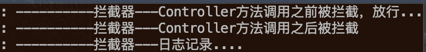
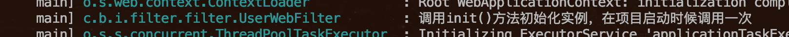
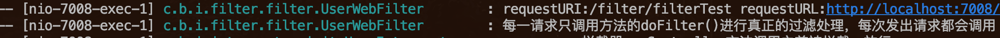
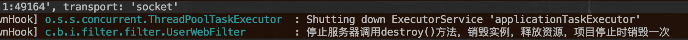
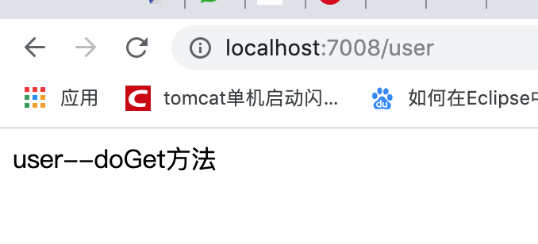

## springboot使用 拦截器  过滤器   servlet
[项目地址](https://github.com/heng1234/springboot2.x/tree/master/inte_filter_servlet)：https://github.com/heng1234/springboot2.x/tree/master/inte_filter_servlet
##### 一、springboot使用拦截器

**一个拦截器，只有preHandle方法返回true，postHandle、afterCompletion才有可能被执行；如果preHandle方法返回false，则该拦截器的postHandle、afterCompletion必然不会被执行。拦截器不是Filter，却实现了Filter的功能，其原理在于：**

**所有的拦截器(Interceptor)和处理器(Handler)都注册在HandlerMapping中。**
**Spring MVC中所有的请求都是由DispatcherServlet分发的。**
**当请求进入DispatcherServlet.doDispatch()时候，首先会得到处理该请求的Handler（即Controller中对应的方法）以及所有拦截该请求的拦截器。拦截器就是在这里被调用开始工作的。**

新建WebMvcConfigurer实现WebMvcConfigurer

```java


import com.boot.inte_filter_servlet.interceptor.init.UserInterceptor;
import org.springframework.beans.factory.annotation.Autowired;
import org.springframework.context.annotation.Configuration;
import org.springframework.web.servlet.config.annotation.InterceptorRegistry;
import org.springframework.web.servlet.config.annotation.ResourceHandlerRegistry;

/**
 * @author : kaifa
 * create at:  2019-11-04  18:18
 * @description: 拦截器配置
 */
@Configuration
public class WebMvcConfigurer implements org.springframework.web.servlet.config.annotation.WebMvcConfigurer {

    @Autowired
    private UserInterceptor userInterceptor;

    //配置拦截的资源以及放行的资源
    @Override
    public void addInterceptors(InterceptorRegistry registry) {
        /**
         * 拦截器按照顺序执行
         */
       //拦截Controller所有 /*/**   userInterceptor是定义的拦截器
        registry.addInterceptor(userInterceptor)
          //拦截的url /**是所有
                .addPathPatterns("/**")
                //不拦截url
                .excludePathPatterns("/user/notInit")
                //放行静态资源
                .excludePathPatterns("/img/**","/css/**","/fonts/**","/js/**");

    }

    //配置静态资源的位置
    @Override
    public void addResourceHandlers(ResourceHandlerRegistry registry) {

    }

}
```

定义拦截器

UserInterceptor实现HandlerInterceptor

```java

import org.slf4j.Logger;
import org.slf4j.LoggerFactory;
import org.springframework.stereotype.Component;
import org.springframework.web.servlet.HandlerInterceptor;
import org.springframework.web.servlet.ModelAndView;

import javax.servlet.http.HttpServletRequest;
import javax.servlet.http.HttpServletResponse;

/**
 * @author : kaifa
 * create at:  2019-11-05  10:24
 * @description: 拦截器
 */
@Component
public class UserInterceptor implements HandlerInterceptor {

    /**
     * log日志
     */
    Logger log= LoggerFactory.getLogger(this.getClass());

    /**
     * 预处理回调方法，实现处理器的预处理（如检查登陆），第三个参数为响应的处理器，自定义Controller
     * 返回值：true表示继续流程（如调用下一个拦截器或处理器）；false表示流程中断（如登录检查失败），不会继续调用其他的拦截器或处理器，此时我们需要通过response来产生响应；
     */
    @Override
    public boolean preHandle(HttpServletRequest request, HttpServletResponse response, Object handler) throws Exception {
        log.info("----------拦截器---Controller方法调用之前被拦截，放行...");
        return true;
    }

    /**
     * 后处理回调方法，实现处理器的后处理（但在渲染视图之前），此时我们可以通过modelAndView（模型和视图对象）对模型数据进行处理或对视图进行处理，modelAndView也可能为null。
     */
    @Override
    public void postHandle(HttpServletRequest request, HttpServletResponse response, Object handler, ModelAndView modelAndView) throws Exception {
        log.info("----------拦截器---Controller方法调用之后被拦截");

    }
    /**
     * 整个请求处理完毕回调方法，即在视图渲染完毕时回调，如性能监控中我们可以在此记录结束时间并输出消耗时间，还可以进行一些资源清理，类似于try-catch-finally中的finally，但仅调用处理器执行链中
     */
    @Override
    public void afterCompletion(HttpServletRequest request, HttpServletResponse response, Object handler, Exception ex) throws Exception {
        log.info("----------拦截器---日志记录....");
    }
}
```

controller测试拦截器

```java

import org.springframework.web.bind.annotation.RequestMapping;
import org.springframework.web.bind.annotation.RestController;

/**
 * @author : kaifa
 * create at:  2019-11-05  11:08
 * @description: 测试拦截器
 */
@RestController
@RequestMapping("user")
public class UserController {

    @RequestMapping("init")
    public String init(){
        return "init";
    }


    @RequestMapping("notInit")
    public String notInit(){
        return "notInit";
    }
}
```

访问http://localhost:7008/user/init



访问http://localhost:7008/user/notInit则不会拦截因为拦截器配置了不拦截此路径


##### 二、springboot使用过滤器注解版

在启动类加上@ServletComponentScan注解

UserWebFilter

```java

import org.slf4j.Logger;
import org.slf4j.LoggerFactory;
import org.springframework.core.annotation.Order;

import javax.servlet.*;
import javax.servlet.annotation.WebFilter;
import javax.servlet.http.HttpServletRequest;
import java.io.IOException;

/**
 * @author : kaifa
 * create at:  2019-11-05  17:59
 * @description: 使用拦截器注解版
 */
@Order(1)//优先级
@WebFilter(filterName = "userfilter",urlPatterns = "/*")
public class UserWebFilter implements Filter {

    /**
     * log日志
     */
    Logger log= LoggerFactory.getLogger(this.getClass());

    /**
     * 该方法由 web 容器调用,以指示 Filter 已经投入使用。servlet容器在实例化过滤器之后调用init方法一次。在要求过滤器执行任何过滤工作之前，init方法必须成功完成。当 init 方法出现以下情况时 Filter 将不生效:
     * a.抛出了 ServletException 异常;
     * b.在一段时间内没有返回结果(超时了)
     * @param filterConfig
     * @throws ServletException
     */
    @Override
    public void init(FilterConfig filterConfig) throws ServletException {

        log.info("调用init()方法初始化实例，在项目启动时候调用一次");
    }

    @Override
    public void doFilter(ServletRequest servletRequest, ServletResponse servletResponse, FilterChain filterChain) throws IOException, ServletException {
        HttpServletRequest request = (HttpServletRequest) servletRequest;
        String requestURI = request.getRequestURI();
        StringBuffer requestURL = request.getRequestURL();
        log.info("requestURI:" +requestURI+" "+"requestURL:"+requestURL);
        log.info("每一请求只调用方法的doFilter()进行真正的过滤处理，每次发出请求都会调用");
        filterChain.doFilter(request, servletResponse);
    }

    @Override
    public void destroy() {
        log.info("停止服务器调用destroy()方法，销毁实例，释放资源，项目停止时销毁一次");
    }
}
```

测试过滤器

```java

import org.springframework.web.bind.annotation.RequestMapping;
import org.springframework.web.bind.annotation.RestController;

/**
 * @author : kaifa
 * create at:  2019-11-05  18:23
 * @description: 测试过滤器
 */
@RestController
@RequestMapping("filter")
public class FilterController {
    @RequestMapping("filterTest")
    public String filterTest(){
        return "this filter";
    }
}
```

启动项目



访问url



停止工程




##### 三、springboot使用servlet

UserServlet

```java

import lombok.extern.slf4j.Slf4j;

import javax.servlet.ServletException;
import javax.servlet.annotation.WebServlet;
import javax.servlet.http.HttpServlet;
import javax.servlet.http.HttpServletRequest;
import javax.servlet.http.HttpServletResponse;
import java.io.IOException;

/**
 * @author : kaifa
 * create at:  2019-11-06  09:50
 * @description: servlet
 */
@WebServlet(urlPatterns = "/user")
@Slf4j
public class UserServlet extends HttpServlet {
    @Override
    protected void doGet(HttpServletRequest req, HttpServletResponse resp) throws ServletException, IOException {
       log.info("user--doGet方法");
        resp.setHeader("Content-Type","text/html;charset=UTF-8");
        resp.getOutputStream().write("user--doGet方法".getBytes("UTF-8"));
    }

    @Override
    protected void doPost(HttpServletRequest req, HttpServletResponse resp) throws ServletException, IOException {
       doGet(req, resp);
    }
}
```

访问http://localhost:7008/user



##### 四、springboot使用listener 

```java

import lombok.extern.slf4j.Slf4j;

import javax.servlet.annotation.WebListener;
import javax.servlet.http.HttpSessionEvent;
import javax.servlet.http.HttpSessionListener;
import java.util.concurrent.atomic.AtomicInteger;

/**
 * @author : kaifa
 * create at:  2019-11-06  09:57
 * @description: 监听器session
 *
 *
 * */
@Slf4j
@WebListener
public class MyListener implements HttpSessionListener {
    private AtomicInteger onLineCount = new AtomicInteger(0);
/**
 *  ServletContextListener -- 监听servletContext对象的创建以及销毁
 *
 *         contextInitialized(ServletContextEvent arg0)   -- 创建时执行
 *
 *         contextDestroyed(ServletContextEvent arg0)  -- 销毁时执行
 *
 *  HttpSessionListener  -- 监听session对象的创建以及销毁
 *
 *       sessionCreated(HttpSessionEvent se)   -- 创建时执行
 *
 *       sessionDestroyed(HttpSessionEvent se) -- 销毁时执行
 *
 *       ServletRequestListener -- 监听request对象的创建以及销毁
 *
 *         requestInitialized(ServletRequestEvent sre) -- 创建时执行
 *
 *        requestDestroyed(ServletRequestEvent sre) -- 销毁时执行
 *
 *  ServletContextAttributeListener  -- 监听servletContext对象中属性的改变
 *
 *         attributeAdded(ServletContextAttributeEvent event) -- 添加属性时执行
 *
 *         attributeReplaced(ServletContextAttributeEvent event) -- 修改属性时执行
 *
 *         attributeRemoved(ServletContextAttributeEvent event) -- 删除属性时执行
 *
 *  HttpSessionAttributeListener  --监听session对象中属性的改变
 *
 *       attributeAdded(HttpSessionBindingEvent event) -- 添加属性时执行
 *
 *        attributeReplaced(HttpSessionBindingEvent event) -- 修改属性时执行
 *
 *        attributeRemoved(HttpSessionBindingEvent event) -- 删除属性时执行
 *
 *          ServletRequestAttributeListener  --监听request对象中属性的改变
 *
 *         attributeAdded(ServletRequestAttributeEvent srae) -- 添加属性时执行
 *
 *        attributeReplaced(ServletRequestAttributeEvent srae) -- 修改属性时执行
 *
 *        attributeRemoved(ServletRequestAttributeEvent srae) -- 删除属性时执行
* */
    @Override
    public void sessionCreated(HttpSessionEvent se) {
        se.getSession().getServletContext().setAttribute("onLineCount", onLineCount.incrementAndGet());
        log.info("session初始化完成");
    }

    @Override
    public void sessionDestroyed(HttpSessionEvent se) {
        log.info("session销毁");
        se.getSession().getServletContext().setAttribute("onLineCount", onLineCount.decrementAndGet());

    }
}
```