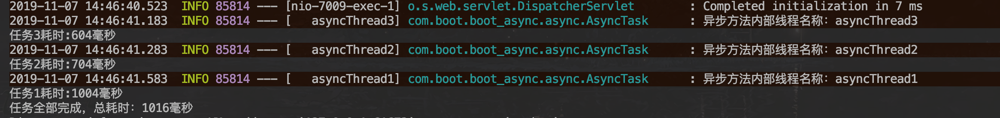
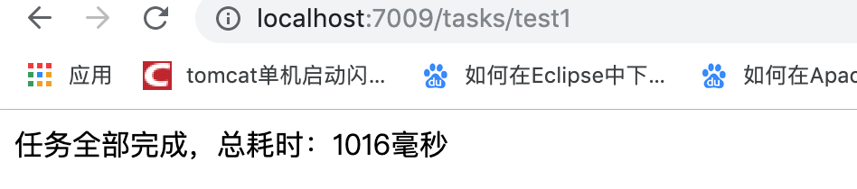

# Spring Boot 中使用异步调用(线程池)

使用场景: 发送短信 发送邮件 App消息推送 节省运维凌晨发布任务时间提供效率

[项目地址](https://github.com/heng1234/springboot2.x/tree/master/boot_async):https://github.com/heng1234/springboot2.x/tree/master/boot_async

## 开启异步

首先得在Spring Boot入口类上加上`@EnableAsync`注解

```java

import org.springframework.boot.SpringApplication;
import org.springframework.boot.autoconfigure.SpringBootApplication;
import org.springframework.scheduling.annotation.EnableAsync;

@SpringBootApplication
@EnableAsync//开启异步
public class BootAsyncApplication {

    public static void main(String[] args) {
        SpringApplication.run(BootAsyncApplication.class, args);
    }

}
```

## 自定义异步线程池

默认情况下的异步线程池配置使得线程不能被重用，每次调用异步方法都会新建一个线程，我们可以自己定义异步线程池来优化

AsyncPoolConfig

```java
import org.apache.tomcat.util.threads.ThreadPoolExecutor;
import org.springframework.context.annotation.Bean;
import org.springframework.context.annotation.Configuration;
import org.springframework.scheduling.concurrent.ThreadPoolTaskExecutor;

/**
 * @author : kaifa
 * create at:  2019-11-07  14:38
 * @description: 自定义异步线程池
 */
@Configuration
public class AsyncPoolConfig {
    /**
     *
     * ThreadPoolTaskExecutor的一些方法自定义了一个线程池，这些方法的含义如下所示：
     *
     * corePoolSize：线程池核心线程的数量，默认值为1（这就是默认情况下的异步线程池配置使得线程不能被重用的原因）。
     *
     * maxPoolSize：线程池维护的线程的最大数量，只有当核心线程都被用完并且缓冲队列满后，才会开始申超过请核心线程数的线程，默认值为Integer.MAX_VALUE。
     *
     * queueCapacity：缓冲队列。
     *
     * keepAliveSeconds：超出核心线程数外的线程在空闲时候的最大存活时间，默认为60秒。
     *
     * threadNamePrefix：线程名前缀。
     *
     * waitForTasksToCompleteOnShutdown：是否等待所有线程执行完毕才关闭线程池，默认值为false。
     *
     * awaitTerminationSeconds：waitForTasksToCompleteOnShutdown的等待的时长，默认值为0，即不等待。
     *
     * rejectedExecutionHandler：当没有线程可以被使用时的处理策略（拒绝任务），默认策略为abortPolicy，包含下
     * callerRunsPolicy：用于被拒绝任务的处理程序，它直接在 execute 方法的调用线程中运行被拒绝的任务；如果执行程序已关闭，则会丢弃该任务。
     *
     * abortPolicy：直接抛出java.util.concurrent.RejectedExecutionException异常。
     *
     * discardOldestPolicy：当线程池中的数量等于最大线程数时、抛弃线程池中最后一个要执行的任务，并执行新传入的任务。
     *
     * discardPolicy：当线程池中的数量等于最大线程数时，不做任何动作。
     *
     * */
    @Bean
    public ThreadPoolTaskExecutor asyncThreadPoolTaskExecutor(){
        ThreadPoolTaskExecutor executor = new ThreadPoolTaskExecutor();
        executor.setCorePoolSize(20);
        executor.setMaxPoolSize(200);
        executor.setQueueCapacity(25);
        executor.setKeepAliveSeconds(200);
        executor.setThreadNamePrefix("asyncThread");
        executor.setWaitForTasksToCompleteOnShutdown(true);
        executor.setAwaitTerminationSeconds(60);
        executor.setRejectedExecutionHandler(new ThreadPoolExecutor.CallerRunsPolicy());
        executor.initialize();
        return executor;
    }
}
```

@Async 注解上指定线程池Bean名称

```java

import lombok.extern.slf4j.Slf4j;
import org.springframework.scheduling.annotation.Async;
import org.springframework.scheduling.annotation.AsyncResult;
import org.springframework.stereotype.Component;

import java.util.concurrent.Future;

/**
 * @author : kaifa
 * create at:  2019-11-07  09:50
 * @description: 异步类
 * @Async标注为异步方法
 * 如果有返回值需要用Future方式返回
 */
@Component
@Slf4j
public class AsyncTask {
    @Async("asyncThreadPoolTaskExecutor")
    public Future<Boolean> doTask11() throws Exception {
        long start = System.currentTimeMillis();
        Thread.sleep(1000);
        long end = System.currentTimeMillis();
        log.info("异步方法内部线程名称：{}", Thread.currentThread().getName());
        System.out.println("任务1耗时:" + (end - start) + "毫秒");
        return new AsyncResult<>(true);
    }

    @Async("asyncThreadPoolTaskExecutor")
    public Future<Boolean> doTask22() throws Exception {
        long start = System.currentTimeMillis();
        Thread.sleep(700);
        long end = System.currentTimeMillis();
        log.info("异步方法内部线程名称：{}", Thread.currentThread().getName());
        System.out.println("任务2耗时:" + (end - start) + "毫秒");
        return new AsyncResult<>(true);
    }

    @Async("asyncThreadPoolTaskExecutor")
    public Future<Boolean> doTask33() throws Exception {
        long start = System.currentTimeMillis();
        Thread.sleep(600);
        long end = System.currentTimeMillis();
        log.info("异步方法内部线程名称：{}", Thread.currentThread().getName());
        System.out.println("任务3耗时:" + (end - start) + "毫秒");
        return new AsyncResult<>(true);
    }
}
```

controller测试

```java

import com.boot.boot_async.async.AsyncTask;
import org.springframework.beans.factory.annotation.Autowired;
import org.springframework.web.bind.annotation.RequestMapping;
import org.springframework.web.bind.annotation.RestController;

import java.util.concurrent.Future;

/**
 * @author : kaifa
 * create at:  2019-11-07  10:05
 * @description: 测试异步方法controller
 */
@RestController
@RequestMapping("tasks")
public class DoTaskController {
    @Autowired
    private AsyncTask asyncTask;

    @RequestMapping("test1")
    public String test1() throws Exception {

        long start = System.currentTimeMillis();

        Future<Boolean> a = asyncTask.doTask11();
        Future<Boolean> b = asyncTask.doTask22();
        Future<Boolean> c = asyncTask.doTask33();

        while (!a.isDone() || !b.isDone() || !c.isDone()) {
            if (a.isDone() && b.isDone() && c.isDone()) {
                break;
            }
        }

        long end = System.currentTimeMillis();

        String times = "任务全部完成，总耗时：" + (end - start) + "毫秒";
        System.out.println(times);

        return times;
    }
}
```

访问 http://localhost:7009/tasks/test1 





下一章:[springboot中配置定时任务(cron表达式)线程池方式](../task/task.md)