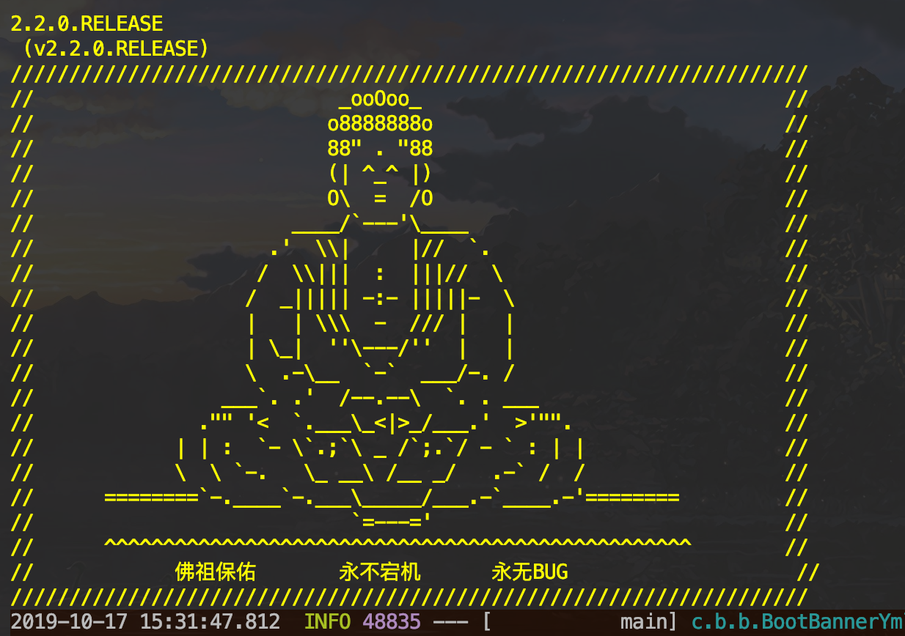
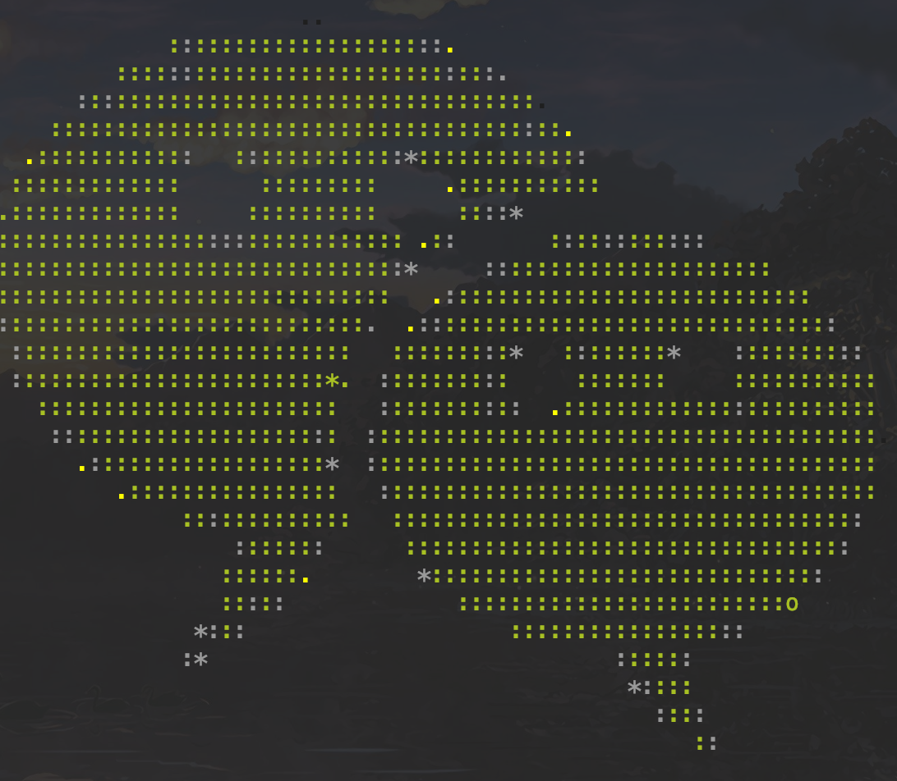

# springboot定制banner

##### 什么是banner 

###### (项目地址:https://github.com/heng1234/springboot2.x/tree/master/boot_banner_yml)

springboot启动的时候出现的这个文案就是banner

```ruby
  .   ____          _            __ _ _
 /\\ / ___'_ __ _ _(_)_ __  __ _ \ \ \ \
( ( )\___ | '_ | '_| | '_ \/ _` | \ \ \ \
 \\/  ___)| |_)| | | | | || (_| |  ) ) ) )
  '  |____| .__|_| |_|_| |_\__, | / / / /
 =========|_|==============|___/=/_/_/_/
 :: Spring Boot ::       (v2.2.0.RELEASE)
```

SpringBoot 有一个接口 `org.springframework.boot.Banner` 是专门来做这个操作的。我们可以实现这个接口来自定义打印 Banner 信息；

- org.springframework.boot.ResourceBanner

  > 文本格式，SpringBoot 会读取配置项`banner.txt`和`banner.location`，从配置项中获取真实的文件地址；如果配置中没有配置，会把配置项作为文件去加载；

- org.springframework.boot.ImageBanner

  > 图片格式，SpringBoot 加载配置项`banner.image.location`，从配置项中获取真实的路径，SpringBoot 会根据配置项的路径加载文件。
  > 如果没有配置`banner.image.location`，转而依次加载`banner.gif`、`banner.jpg`、 `banner.png`这三个中存在的文件；

如果上面两种都没有配置，SpringBoot 就会加载默认的 Banner；

##### 官网介绍:

以通过将`banner.txt`文件添加到类路径或将`spring.banner.location`属性设置为此类文件的位置来更改启动时打印的横幅。如果文件的编码不是UTF-8，则可以设置`spring.banner.charset`。除了一个文本文件，你还可以添加一个`banner.gif`，`banner.jpg`或`banner.png`图像文件到类路径或设置`spring.banner.image.location`属性。图像将转换为ASCII艺术作品并打印在任何文字横幅上方。

在`banner.txt`文件内部，可以使用以下任意占位符：

| 变量                                                         | 描述                                                         |
| :----------------------------------------------------------- | :----------------------------------------------------------- |
| `${application.version}`                                     | 您的应用程序的版本号，如中所述`MANIFEST.MF`。例如，`Implementation-Version: 1.0`打印为`1.0`。 |
| `${application.formatted-version}`                           | 您的应用程序的版本号，已声明`MANIFEST.MF`并进行了格式显示（用括号括起来，并带有前缀`v`）。例如`(v1.0)`。 |
| `${spring-boot.version}`                                     | 您正在使用的Spring Boot版本。例如`2.2.1.BUILD-SNAPSHOT`。    |
| `${spring-boot.formatted-version}`                           | 您正在使用的Spring Boot版本，其格式用于显示（用括号括起来，并带有前缀`v`）。例如`(v2.2.1.BUILD-SNAPSHOT)`。 |
| `${Ansi.NAME}`（或`${AnsiColor.NAME}`，`${AnsiBackground.NAME}`，`${AnsiStyle.NAME}`） | `NAME`ANSI转义代码的名称在哪里。有关[`AnsiPropertySource`](https://github.com/spring-projects/spring-boot/tree/master/spring-boot-project/spring-boot/src/main/java/org/springframework/boot/ansi/AnsiPropertySource.java)详细信息，请参见。 |
| `${application.title}`                                       | 您的应用程序的标题，如中所述`MANIFEST.MF`。例如`Implementation-Title: MyApp`打印为`MyApp`。 |

|      | `SpringApplication.setBanner(…)`如果要以编程方式生成横幅，则可以使用 该方法。使用该`org.springframework.boot.Banner`接口并实现您自己的`printBanner()`方法。 |
| ---- | ------------------------------------------------------------ |
|      |                                                              |

您还可以使用该`spring.main.banner-mode`属性来确定横幅是否必须在`System.out`（`console`）上打印，发送到配置的记录器（`log`）或根本不制作（`off`）。

打印的横幅注册为下以下名称的单例的bean： `springBootBanner`。

##### 开始使用

首先在resource下创建一个banner.txt文件

里面内容填写:

```java
${AnsiColor.BRIGHT_YELLOW}
${application.version}
${application.formatted-version}
${spring-boot.version}
${spring-boot.formatted-version}
////////////////////////////////////////////////////////////////////
//                          _ooOoo_                               //
//                         o8888888o                              //
//                         88" . "88                              //
//                         (| ^_^ |)                              //
//                         O\  =  /O                              //
//                      ____/`---'\____                           //
//                    .'  \\|     |//  `.                         //
//                   /  \\|||  :  |||//  \                        //
//                  /  _||||| -:- |||||-  \                       //
//                  |   | \\\  -  /// |   |                       //
//                  | \_|  ''\---/''  |   |                       //
//                  \  .-\__  `-`  ___/-. /                       //
//                ___`. .'  /--.--\  `. . ___                     //
//              ."" '<  `.___\_<|>_/___.'  >'"".                  //
//            | | :  `- \`.;`\ _ /`;.`/ - ` : | |                 //
//            \  \ `-.   \_ __\ /__ _/   .-` /  /                 //
//      ========`-.____`-.___\_____/___.-`____.-'========         //
//                           `=---='                              //
//      ^^^^^^^^^^^^^^^^^^^^^^^^^^^^^^^^^^^^^^^^^^^^^^^^^^        //
//            佛祖保佑       永不宕机      永无BUG                　　//
////////////////////////////////////////////////////////////////////
```

然后启动springboot就会出现



[banner在线生成地址](http://patorjk.com/software/taag/#p=display&f=Graffiti&t=Type%20Something%20)


##### SpringBoot 图片 Banner 定制

图片的 banner 支持 gif 、png、jpeg 格式的图片。使用的时候，选用合适的图片，然后将图片名字改成 banner，然后和文字的 banner.txt 文件一样，放到 resource ，目录下即可。

例如，我们将一个如下的 jpeg 格式的微博 logo 改名为 banner.jpg 文件放到 resource 目录下


启动显示




##### 

##### 可自定义SpringApplication

如果`SpringApplication`默认设置不符合您的喜好，则可以创建一个本地实例并对其进行自定义。例如，要关闭横幅，您可以编写：

```java
public static void main(String[] args) {
    SpringApplication app = new SpringApplication(MySpringConfiguration.class);
    app.setBannerMode(Banner.Mode.OFF);
    app.run(args);
}
```

[下一章:springboot读取配置文件](./pro.md)