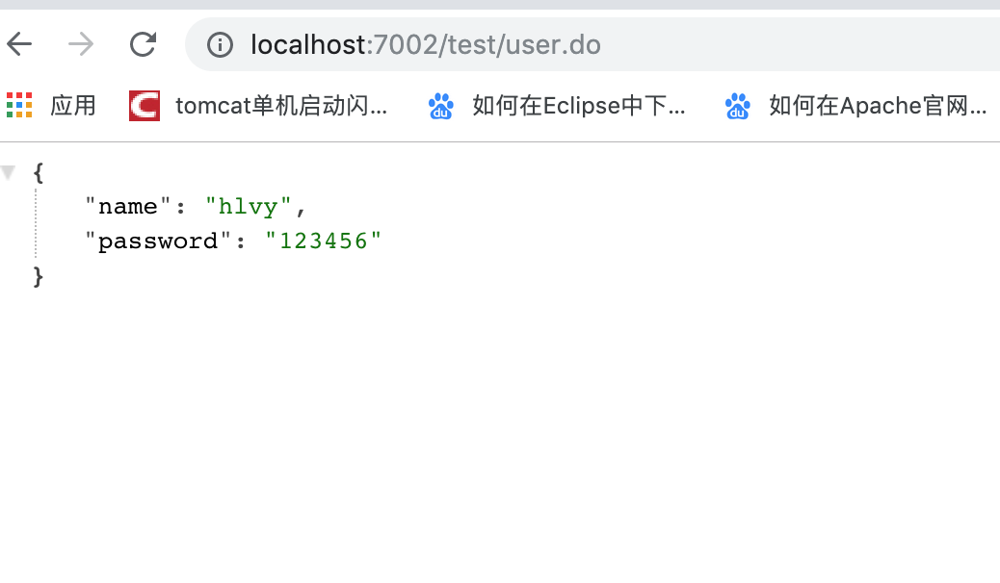
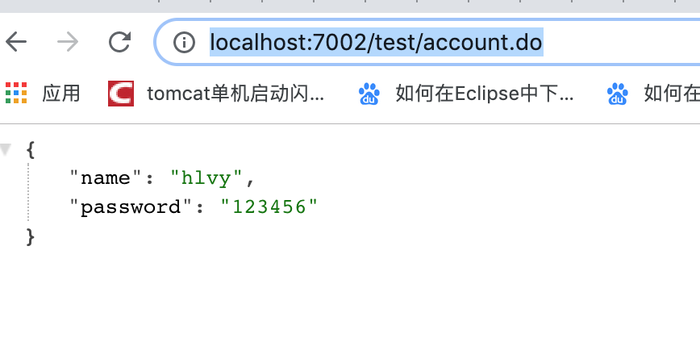
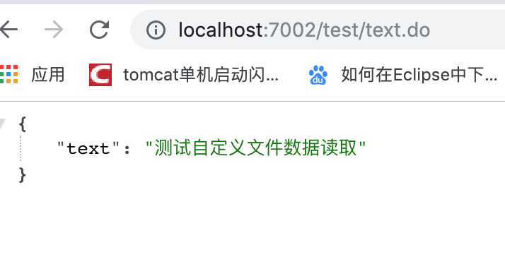

# springboot读取配置文件

##### 前言 (项目地址:https://github.com/heng1234/springboot2.x/tree/master/boot_banner_yml)

Spring-Boot的核心配置文件是application.properties ，会默认读取该配置文件，当然也可以通过注解自定义配置文件的信息。

为什要这样读取

开发中，经常会有一些常量，变动较少，但是我们不能在java代码中写死，这样每次修改都得去java代码中修改，引用地方较多时我们需要修改很多java文件；所以我们可以集中写在某个配置文件中，这样只用修改配置文件就好


##### 读取方法一 使用@value注解读取

首先application.yml文件里写入需要读取的数据

```yml
lv:
  name: hlvy
  password: 123456
```

User类

```java
import lombok.Data;
import org.springframework.beans.factory.annotation.Value;
import org.springframework.stereotype.Component;

import java.io.Serializable;

/**
 * @author : kaifa
 * create at:  2019-10-18  14:36
 * @description: springboot读取配置文件信息
 */
//lombok
@Data
@Component
public class User implements Serializable {

    @Value("${lv.name}")
    private String name;

    @Value("${lv.password}")
    private String password;
}
```

测试controller类

```java
package com.boot.boot_banner_yml.controller;

import com.boot.boot_banner_yml.profile.Account;
import com.boot.boot_banner_yml.profile.Text;
import com.boot.boot_banner_yml.profile.User;
import org.springframework.beans.factory.annotation.Autowired;
import org.springframework.web.bind.annotation.RequestMapping;
import org.springframework.web.bind.annotation.RestController;

/**
 * @author : kaifa
 * create at:  2019-10-18  14:47
 * @description: 测试读取配置文件
 */
@RestController
@RequestMapping("test")
public class TestController {

    @Autowired
    private User user;
  
    /**
     * @Value 读取application.yml数据
     * @return
     */
    @RequestMapping("user")
    public User readFileUser(){
        return user;
    }
   
    
}
```

访问http://localhost:7002/test/user.do 显示



##### 方法二使用前缀读取

创建Account类

```java
package com.boot.boot_banner_yml.profile;

import lombok.Data;
import org.springframework.boot.context.properties.ConfigurationProperties;
import org.springframework.stereotype.Component;

import java.io.Serializable;

/**
 * @author : kaifa
 * create at:  2019-10-18  14:36
 * @description: springboot读取配置文件信息
 */
//配置文件前缀
@ConfigurationProperties(prefix="lv")
@Component
//lombok
@Data
public class Account implements Serializable {
    /**
     * 这里不需要写@value注解了  这里的名字与配置文件一致
     */
    private String name;

    private String password;
}
```

controller测试

```java
@Autowired
private Account account;

 /**
     * 读取application.yml数据
     * 读取前缀
     * @return
     */
    @RequestMapping("account")
    public Account readFileAccount(){
        return account;
    }
```

访问http://localhost:7002/test/account.do

显示



##### 方法三使用自定义properties文件读取

首先在resources创建

val.properties

```
val.text= 测试自定义文件数据读取
```

然后创建Text类

```java
import lombok.Data;
import org.springframework.boot.context.properties.ConfigurationProperties;
import org.springframework.context.annotation.PropertySource;
import org.springframework.stereotype.Component;

import java.io.Serializable;

/**
 * @author : kaifa
 * create at:  2019-10-18  14:36
 * @description: springboot读取配置文件信息
 */
//配置文件前缀
@ConfigurationProperties(prefix="val")
// 获取外部的配置文件文件,需要指定配置文件的路径
@PropertySource(
        value = "classpath:val.properties",
        encoding = "utf-8"
)
@Component
//lombok
@Data
public class Text implements Serializable {
    /**
     * 这里不需要写@value注解了  这里的名字与配置文件一致
     */
    private String text;

}
```

controller测试

```java
@Autowired
private Text text;


    /**
     * 自定义val.yml读取文件
     * @return
     */
    @RequestMapping("text")
    public Text readFileText(){
        return text;
    }
```

访问http://localhost:7002/test/text.do 显示



[下一章:springboot访问路径配置和Profile配置说明](./webmvc.md)