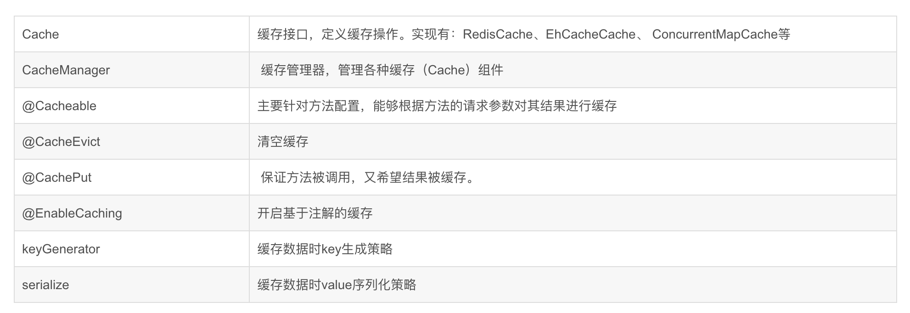
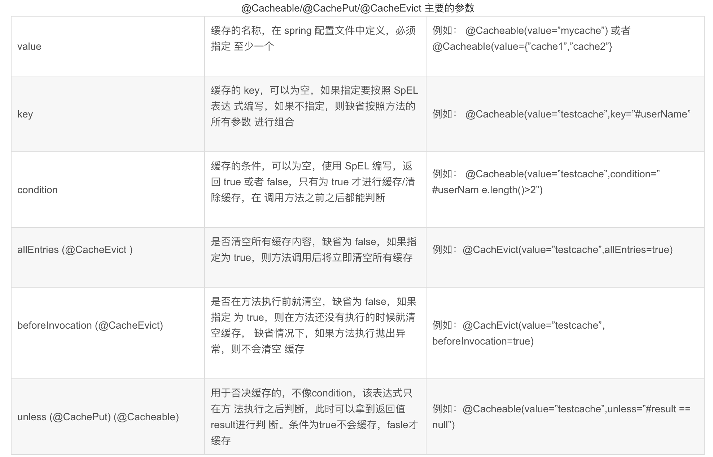
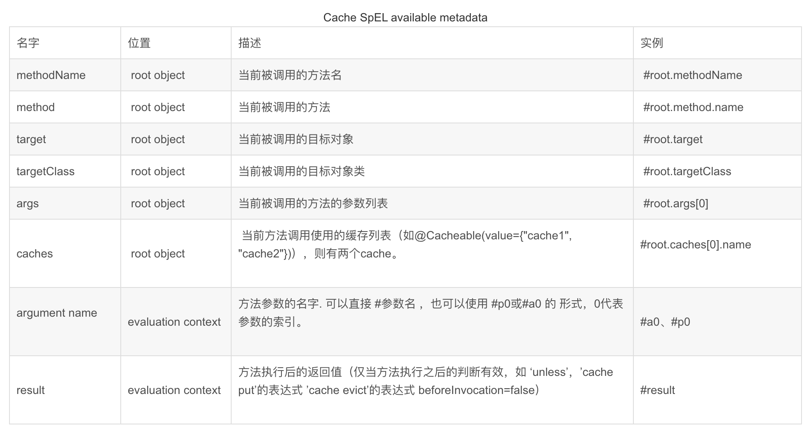

# Spring Boot ehcache使用与整合

Ehcache 也是 Java 领域比较优秀的缓存方案之一Spring Boot 中对此也提供了很好的支持，这个支持主要是通过 Spring Cache 来实现的。

`ehcache`是一种广泛使用的开源`Java`分布式缓存。主要面向通用缓存,`Java EE`和轻量级容器。它具有内存和磁盘存储，缓存加载器,缓存扩展,缓存异常处理程序,一个`gzip`缓存`servlet`过滤器,支持`REST`和`SOAP api`等特点。

[项目地址](https://github.com/heng1234/springboot2.x/tree/master/boot_cache):https://github.com/heng1234/springboot2.x/tree/master/boot_cache


Spring cache缓存注解介绍







## @CacheConfig

这个注解在类上使用，用来描述该类中所有方法使用的缓存名称，当然也可以不使用该注解，直接在具体的缓存注解上配置名称

## @Cacheable

这个注解一般加在查询方法上，表示将一个方法的返回值缓存起来，默认情况下，缓存的 key 就是方法的参数，缓存的 value 就是方法的返回值。

## @CachePut

这个注解一般加在更新方法上，当数据库中的数据更新后，缓存中的数据也要跟着更新，使用该注解，可以将方法的返回值自动更新到已经存在的 key 上

## @CacheEvict

这个注解一般加在删除方法上，当数据库中的数据删除后，相关的缓存数据也要自动清除，该注解在使用的时候也可以配置按照某种条件删除（ condition 属性）或者或者配置清除所有缓存（ allEntries 属性）


开始使用ehcache

pom.xml引入

```xml
<!--spring cache-->
    <dependency>
        <groupId>org.springframework.boot</groupId>
        <artifactId>spring-boot-starter-cache</artifactId>
    </dependency>
    <!--ehcache-->
    <dependency>
        <groupId>net.sf.ehcache</groupId>
        <artifactId>ehcache</artifactId>
        <version>2.10.6</version>
    </dependency>
```

yml配置

> 需要说明的是`config:classpath:/ehcache.xml`可以不用写，因为默认就是这个路径。但`ehcache.xml`必须有。
>
> ```yml
> spring:
>   cache:
>     ehcache:
>       config: classpath:ehcache.xml
> ```
>
> 

ehcache.xml

在`resources`目录下新建`config`文件夹,在文件夹中建立`ehcache.xml`文件。

```yml
<?xml version="1.0" encoding="UTF-8"?>
<ehcache>
    <defaultCache
            maxElementsInMemory="10000"
            eternal="false"
            timeToIdleSeconds="3600"
            timeToLiveSeconds="0"
            overflowToDisk="false"
            diskPersistent="false"
            diskExpiryThreadIntervalSeconds="120" />

    <cache
            name="myuser"
            maxEntriesLocalHeap="2000"
            eternal="false"
            timeToIdleSeconds="3600"
            timeToLiveSeconds="0"
            overflowToDisk="false"
            statistics="true">
    </cache>
</ehcache>
<!--配置含义：

name:缓存名称。
maxElementsInMemory：缓存最大个数。
eternal:对象是否永久有效，一但设置了，timeout将不起作用。
timeToIdleSeconds：设置对象在失效前的允许闲置时间（单位：秒）。仅当eternal=false对象不是永久有效时使用，可选属性，默认值是0，也就是可闲置时间无穷大。
timeToLiveSeconds：设置对象在失效前允许存活时间（单位：秒）。最大时间介于创建时间和失效时间之间。仅当eternal=false对象不是永久有效时使用，默认是0.，也就是对象存活时间无穷大。
overflowToDisk：当内存中对象数量达到maxElementsInMemory时，Ehcache将会对象写到磁盘中。
diskSpoolBufferSizeMB：这个参数设置DiskStore（磁盘缓存）的缓存区大小。默认是30MB。每个Cache都应该有自己的一个缓冲区。
maxElementsOnDisk：硬盘最大缓存个数。
diskPersistent：是否缓存虚拟机重启期数据。
diskExpiryThreadIntervalSeconds：磁盘失效线程运行时间间隔，默认是120秒。
memoryStoreEvictionPolicy：当达到maxElementsInMemory限制时，Ehcache将会根据指定的策略去清理内存。默认策略是LRU（最近最少使用）。你可以设置为FIFO（先进先出）或是LFU（较少使用）。
clearOnFlush：内存数量最大时是否清除。
diskStore 则表示临时缓存的硬盘目录。
-->
```

使用缓存 UserService

```java

import com.boot.boot_cache.entity.User;
import com.boot.boot_cache.mapper.UserMapper;
import org.springframework.beans.factory.annotation.Autowired;
import org.springframework.cache.annotation.CacheConfig;
import org.springframework.cache.annotation.CachePut;
import org.springframework.cache.annotation.Cacheable;
import org.springframework.stereotype.Service;
import org.springframework.transaction.annotation.Transactional;

import java.util.List;

/**
 * @author : kaifa
 * create at:  2019-10-22  10:10
 * @description: user 业务层
 */
@Service
@CacheConfig(cacheNames = "myuser")//对应ehcache.xml配置文件配置的缓存名称
public class UserService {

    @Autowired
    private UserMapper userMapper;


    /**
     * 查询所有用户
     * @return
     */
    @Cacheable
   public List<User> selectListAll(){
        return userMapper.selectListAll();
    }

    /**
     * 修改用户
     * @param user
     * @return
     */

    @CachePut(key = "#user.id")
    @Transactional
   public User updateUser(User user){
         userMapper.updateUser(user) ;
         return userMapper.findUserById(user.getId());//这里修改后需要查询一遍进行缓存
    }
    /**
     * 查询所有用户
     * @return
     */
    @Cacheable(key = "#id")
    public User findUserById(Integer id){
        return userMapper.findUserById(id);
    }
   /* @CacheEvict(key = "#user.id")
    @Transactional
    public void updateUser(User user){
         userMapper.updateUser(user) ;
    }*/

}
```

UserMapper

```java


import com.boot.boot_cache.entity.User;

import java.util.List;

/**
 * @author : kaifa
 * create at:  2019-10-22  10:10
 * @description: user mapper接口
 */
public interface UserMapper {

    /**查询所有用户*/
    List<User> selectListAll();

    /**
     * 修改用户信息
     * @param user
     * @return
     */
    int updateUser(User user);

    /**
     * 根据id查询
     * @param id
     * @return
     */
    User findUserById(Integer id);
}
```

mapper.xml

```xml
<?xml version="1.0" encoding="UTF-8" ?>
<!DOCTYPE mapper PUBLIC "-//mybatis.org//DTD Mapper 3.0//EN"
        "http://mybatis.org/dtd/mybatis-3-mapper.dtd">
<mapper namespace="com.boot.boot_cache.mapper.UserMapper">
    <update id="updateUser" parameterType="com.boot.boot_cache.entity.User">
      update T_USER
      <set>
          <if test="userName != null and userName != ''">
              USERNAME = #{userName},
          </if>
          <if test="password != null and password != ''">
              password = #{password},
          </if>
      </set>
      <where>
          id = #{id}
      </where>
    </update>

    <select id="selectListAll" resultType="com.boot.boot_cache.entity.User">
      select id,username,password,create_time createTime from t_user
    </select>
    <select id="findUserById" resultType="com.boot.boot_cache.entity.User">
        select id,username userName,password,create_time createTime from t_user where id = #{id}
    </select>
</mapper>
```

controller

```java


import com.boot.boot_cache.entity.User;
import com.boot.boot_cache.service.UserService;
import org.springframework.beans.factory.annotation.Autowired;
import org.springframework.web.bind.annotation.RequestMapping;
import org.springframework.web.bind.annotation.RestController;

import java.util.List;

/**
 * @author : kaifa
 * create at:  2019-10-22  10:16
 * @description: user controller
 */
@RestController
@RequestMapping("user")
public class UserController {

    @Autowired
    private UserService userService;

    /**
     * 查询所有用户
     * @return
     */
    @RequestMapping("userList.do")
    List<User> selectListAll(){
        return userService.selectListAll();
    }


    /**
     * 修改用户
     * @return
     */
    @RequestMapping("updateUser.do")
    String  updateUser(User user){
         userService.updateUser(user);
         return "success";
    }

    /**
     * 根据id查询
     * @return
     */
    @RequestMapping("findUserById.do")
    User findUserById(Integer id){
        return userService.findUserById(id);
    }
}
```

访问http://localhost:7007/user/findUserById.do?id=1

第一次会查询数据库

第二次会进入缓存不会访问数据库

接着访问修改数据

http://localhost:7007/user/updateUser.do?id=1&userName=heng&password=1234567

然后继续访问查询会走缓存 

具体看代码

[项目地址](https://github.com/heng1234/springboot2.x/tree/master/boot_cache):https://github.com/heng1234/springboot2.x/tree/master/boot_cache