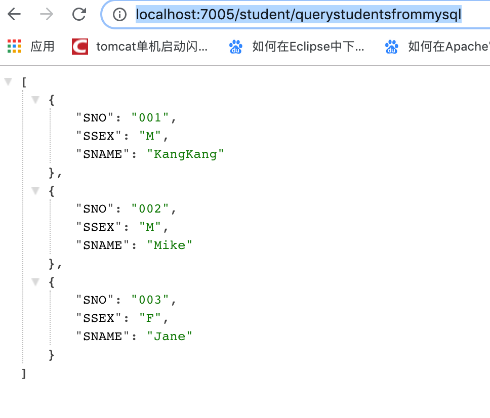
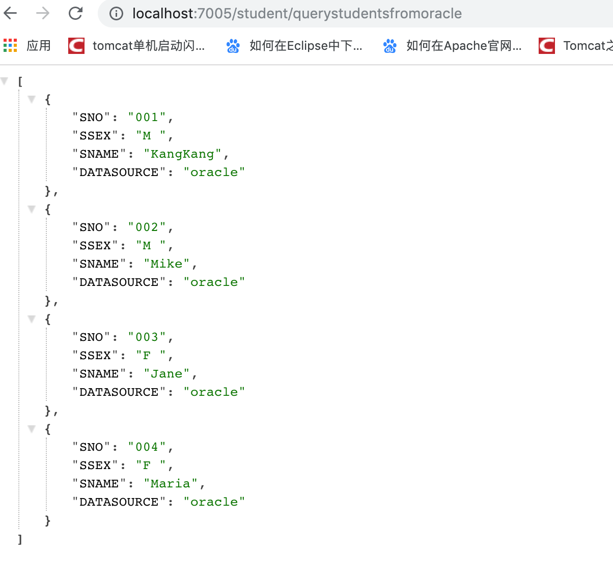

# Spring Boot MyBatis配置Druid多数据源

[项目地址](https://github.com/heng1234/springboot2.x/tree/master/boot_mult_datasource):https://github.com/heng1234/springboot2.x/tree/master/boot_mult_datasource

在实际场景中，会遇到不同用户拥有不同的数据源，这些数据源信息配置在数据库表里面，需要我们根据用户切换成相应的数据源。会介绍如何在SpringBoot + Mybatis中配置多数据源

数据库 mysql：

```sql
CREATE TABLE `student` (
`SNO` varchar(3) NOT NULL,
`SNAME` varchar(9) NOT NULL,
`SSEX` char(2) NOT NULL
) ENGINE=InnoDB DEFAULT CHARSET=utf8mb4;
```

数据mysql：

```sql
INSERT INTO `txlcn-demo`.`student`(`SNO`, `SNAME`, `SSEX`) VALUES ('001', 'KangKang', 'M');
INSERT INTO `txlcn-demo`.`student`(`SNO`, `SNAME`, `SSEX`) VALUES ('002', 'Mike', 'M');
INSERT INTO `txlcn-demo`.`student`(`SNO`, `SNAME`, `SSEX`) VALUES ('003', 'Jane', 'F');
```

数据库 oracle:

```sql
CREATE TABLE "BOOT"."STUDENT"
   (  "SNO" VARCHAR2(3) NOT NULL ENABLE,
   "SNAME" VARCHAR2(9) NOT NULL ENABLE,
   "SSEX" CHAR(2) NOT NULL ENABLE,
   "DATASOURCE" VARCHAR2(10),
   CHECK (SNO IS NOT NULL) ENABLE,
   CHECK (SNAME IS NOT NULL) ENABLE,
   CHECK (SSEX IS NOT NULL) ENABLE
   ) SEGMENT CREATION IMMEDIATE
   PCTFREE 10 PCTUSED 40 INITRANS 1 MAXTRANS 255 NOCOMPRESS LOGGING
   STORAGE(INITIAL 65536 NEXT 1048576 MINEXTENTS 1 MAXEXTENTS 2147483645
   PCTINCREASE 0 FREELISTS 1 FREELIST GROUPS 1 BUFFER_POOL DEFAULT FLASH_CACHE DEFAULT CELL_FLASH_CACHE DEFAULT)
   TABLESPACE "SYSTEM"
```

数据 oracle:

```sql
INSERT INTO "BOOT"."STUDENT"("SNO", "SNAME", "SSEX", "DATASOURCE") VALUES ('001', 'KangKang', 'M ', 'oracle');
   INSERT INTO "BOOT"."STUDENT"("SNO", "SNAME", "SSEX", "DATASOURCE") VALUES ('002', 'Mike', 'M ', 'oracle');
   INSERT INTO "BOOT"."STUDENT"("SNO", "SNAME", "SSEX", "DATASOURCE") VALUES ('003', 'Jane', 'F ', 'oracle');
   INSERT INTO "BOOT"."STUDENT"("SNO", "SNAME", "SSEX", "DATASOURCE") VALUES ('004', 'Maria', 'F ', 'oracle');
```

pom文件引入jar

```xml
<!-- oracle驱动 -->
<dependency>
    <groupId>com.oracle</groupId>
    <artifactId>ojdbc6</artifactId>
    <version>11.2.0.4</version>
</dependency>
<!--alibaba druid-->
<dependency>
    <groupId>com.alibaba</groupId>
    <artifactId>druid-spring-boot-starter</artifactId>
    <version>1.1.10</version>
</dependency>
<!--mybatis-->
<dependency>
    <groupId>org.mybatis.spring.boot</groupId>
    <artifactId>mybatis-spring-boot-starter</artifactId>
    <version>1.3.1</version>
</dependency>
<!--lombok插件-->
<dependency>
    <groupId>org.projectlombok</groupId>
    <artifactId>lombok</artifactId>
    <version>1.18.10</version>
    <optional>true</optional>
</dependency>
<!-- mysql驱动 -->
<dependency>
    <groupId>mysql</groupId>
    <artifactId>mysql-connector-java</artifactId>
</dependency>
```

application.yml中配置多数据源

```yml
server:
  port: 7005
spring:
  datasource:
    druid:
      # 数据库访问配置, 使用druid数据源
      # 数据源1 mysql
      mysql:
        type: com.alibaba.druid.pool.DruidDataSource
        driver-class-name: com.mysql.jdbc.Driver
        url: jdbc:mysql://121.40.179.66:3306/txlcn-demo?characterEncoding=utf8&zeroDateTimeBehavior=convertToNull&useSSL=false&allowMultiQueries=true&useJDBCCompliantTimezoneShift=true&useLegacyDatetimeCode=false&serverTimezone=Asia/Shanghai
        username: root
        password: b9b8-4231-8b38-c395269a93be
      # 数据源2 oracle
      oracle:
        type: com.alibaba.druid.pool.DruidDataSource
        driver-class-name: oracle.jdbc.driver.OracleDriver
        url: jdbc:oracle:thin:@localhost:49161:XE
        username: boot
        password: 123456

      # 连接池配置
      initial-size: 5
      min-idle: 5
      max-active: 20
      # 连接等待超时时间
      max-wait: 30000
      # 配置检测可以关闭的空闲连接间隔时间
      time-between-eviction-runs-millis: 60000
      # 配置连接在池中的最小生存时间
      min-evictable-idle-time-millis: 300000
      validation-query: select '1' from dual
      test-while-idle: true
      test-on-borrow: false
      test-on-return: false
      # 打开PSCache，并且指定每个连接上PSCache的大小
      pool-prepared-statements: true
      max-open-prepared-statements: 20
      max-pool-prepared-statement-per-connection-size: 20
      # 配置监控统计拦截的filters, 去掉后监控界面sql无法统计, 'wall'用于防火墙
      filters: stat,wall
      # Spring监控AOP切入点，如x.y.z.service.*,配置多个英文逗号分隔
      aop-patterns: com.springboot.servie.*


      # WebStatFilter配置
      web-stat-filter:
        enabled: true
        # 添加过滤规则
        url-pattern: /*
        # 忽略过滤的格式
        exclusions: '*.js,*.gif,*.jpg,*.png,*.css,*.ico,/druid/*'

      # StatViewServlet配置
      stat-view-servlet:
        enabled: true
        # 访问路径为/druid时，跳转到StatViewServlet
        url-pattern: /druid/*
        # 是否能够重置数据
        reset-enable: false
        # 需要账号密码才能访问控制台
        login-username: druid
        login-password: druid123
          # IP白名单
          # allow: 127.0.0.1
          #　IP黑名单（共同存在时，deny优先于allow）
        # deny: 192.168.1.218

        # 配置StatFilter
      filter:
        stat:
          log-slow-sql: true
```

创建两个数据源配置类MysqlDatasourceConfig和OracleDatasourceConfig：

MysqlDatasourceConfig：

```java
import com.alibaba.druid.spring.boot.autoconfigure.DruidDataSourceBuilder;
import org.apache.ibatis.session.SqlSessionFactory;
import org.mybatis.spring.SqlSessionFactoryBean;
import org.mybatis.spring.annotation.MapperScan;
import org.springframework.beans.factory.annotation.Qualifier;
import org.springframework.boot.context.properties.ConfigurationProperties;
import org.springframework.context.annotation.Bean;
import org.springframework.context.annotation.Configuration;
import org.springframework.context.annotation.Primary;
import org.springframework.core.io.support.PathMatchingResourcePatternResolver;
import org.springframework.jdbc.datasource.DataSourceTransactionManager;

import javax.sql.DataSource;

/**
 * @author : kaifa
 * create at:  2019-10-24  17:46
 * @description: 上面代码配置了一个名为mysqldatasource的数据源，
 * 对应application.yml中spring.datasource.druid.mysql前缀配置的数据库。
 * 然后创建了一个名为mysqlSqlSessionFactory的Bean，并且注入了mysqldatasource。
 * 与此同时，还分别定了两个扫描路径PACKAGE和MAPPER_LOCATION，前者为Mysql数据库对应的mapper接口地址，
 * 后者为对应的mapper xml文件路径。  @Primary标志这个Bean如果在多个同类Bean候选时，该Bean优先被考虑。
 * 多数据源配置的时候，必须要有一个主数据源，用@Primary标志该Bean。
 */
@Configuration
@MapperScan(basePackages = MysqlDatasourceConfig.PACKAGE, sqlSessionFactoryRef = "mysqlSqlSessionFactory")
public class MysqlDatasourceConfig {
    //mapper扫描路径
    static final String PACKAGE = "com.boot.boot_mult_datasource.mysql.mapper";
    // mybatis mapper xml扫描路径
    static final String MAPPER_LOCATION = "classpath:mysqlmapper/*.xml";

    @Primary
    @Bean(name = "mysqldatasource")
    @ConfigurationProperties("spring.datasource.druid.mysql")
    public DataSource mysqlDataSource() {
        return DruidDataSourceBuilder.create().build();
    }

    @Bean(name = "mysqlTransactionManager")
    @Primary
    public DataSourceTransactionManager mysqlTransactionManager() {
        return new DataSourceTransactionManager(mysqlDataSource());
    }

    @Bean(name = "mysqlSqlSessionFactory")
    @Primary
    public SqlSessionFactory mysqlSqlSessionFactory(@Qualifier("mysqldatasource") DataSource dataSource)
            throws Exception {
        final SqlSessionFactoryBean sessionFactory = new SqlSessionFactoryBean();
        sessionFactory.setDataSource(dataSource);
        //如果不使用xml的方式配置mapper，则可以省去下面这行mapper location的配置。
        sessionFactory.setMapperLocations(new PathMatchingResourcePatternResolver()
                .getResources(MysqlDatasourceConfig.MAPPER_LOCATION));
        return sessionFactory.getObject();
    }
}
```

OracleDatasourceConfig：

```java
import com.alibaba.druid.spring.boot.autoconfigure.DruidDataSourceBuilder;
import org.apache.ibatis.session.SqlSessionFactory;
import org.mybatis.spring.SqlSessionFactoryBean;
import org.mybatis.spring.annotation.MapperScan;
import org.springframework.beans.factory.annotation.Qualifier;
import org.springframework.boot.context.properties.ConfigurationProperties;
import org.springframework.context.annotation.Bean;
import org.springframework.context.annotation.Configuration;
import org.springframework.core.io.support.PathMatchingResourcePatternResolver;
import org.springframework.jdbc.datasource.DataSourceTransactionManager;

import javax.sql.DataSource;

/**
 * @author : kaifa
 * create at:  2019-10-24  17:50
 * @description: Oracle数据库对应的配置
 */
@Configuration
@MapperScan(basePackages = OracleDatasourceConfig.PACKAGE,
        sqlSessionFactoryRef = "oracleSqlSessionFactory")
public class OracleDatasourceConfig {

    // oracledao扫描路径
    static final String PACKAGE = "com.boot.boot_mult_datasource.oracle.mapper";
    // mybatis mapper扫描路径
    static final String MAPPER_LOCATION = "classpath:oraclemapper/*.xml";

    @Bean(name = "oracledatasource")
    @ConfigurationProperties("spring.datasource.druid.oracle")
    public DataSource oracleDataSource() {
        return DruidDataSourceBuilder.create().build();
    }

    @Bean(name = "oracleTransactionManager")
    public DataSourceTransactionManager oracleTransactionManager() {
        return new DataSourceTransactionManager(oracleDataSource());
    }

    @Bean(name = "oracleSqlSessionFactory")
    public SqlSessionFactory oracleSqlSessionFactory(@Qualifier("oracledatasource") DataSource dataSource)
            throws Exception {
        final SqlSessionFactoryBean sessionFactory = new SqlSessionFactoryBean();
        sessionFactory.setDataSource(dataSource);
        //如果不使用xml的方式配置mapper，则可以省去下面这行mapper location的配置。
        sessionFactory.setMapperLocations(new PathMatchingResourcePatternResolver()
                .getResources(OracleDatasourceConfig.MAPPER_LOCATION));
        return sessionFactory.getObject();
    }
}
```

## 测试

配置完多数据源，接下来分别在com.boot.boot_mult_datasource.mysql.mapper路径和com.boot.boot_mult_datasource.oracle.mapper路径下创建两个mapper接口：

MysqlStudentMapper：

```java

import java.util.List;
import java.util.Map;


public interface MysqlStudentMapper {
   List<Map<String, Object>> getAllStudents();
}
```

OracleStudentMapper：

```java
import java.util.List;
import java.util.Map;

public interface OracleStudentMapper {
   List<Map<String, Object>> getAllStudents();
}
```

接着创建mapper接口对应的实现：

resources下的mysqlmapper创建

MysqlStudentMapper.xml：

```xml
<?xml version="1.0" encoding="UTF-8" ?>    
    <!DOCTYPE mapper PUBLIC "-//mybatis.org//DTD Mapper 3.0//EN"   
"http://mybatis.org/dtd/mybatis-3-mapper.dtd">     
<mapper namespace="com.boot.boot_mult_datasource.mysql.mapper.MysqlStudentMapper">
    <select id="getAllStudents" resultType="java.util.Map">
        select * from student
    </select>
</mapper>
```

resources下的oraclemapper创建

OracleStudentMapper.xml：

```xml
<?xml version="1.0" encoding="UTF-8" ?>    
    <!DOCTYPE mapper PUBLIC "-//mybatis.org//DTD Mapper 3.0//EN"   
"http://mybatis.org/dtd/mybatis-3-mapper.dtd">     
<mapper namespace="com.boot.boot_mult_datasource.oracle.mapper.OracleStudentMapper">
    <select id="getAllStudents" resultType="java.util.Map">
        select * from student
    </select>
</mapper>
```

项目结构:


访问：http://localhost:7005/student/querystudentsfrommysql



访问:http://localhost:7005/student/querystudentsfromoracle

