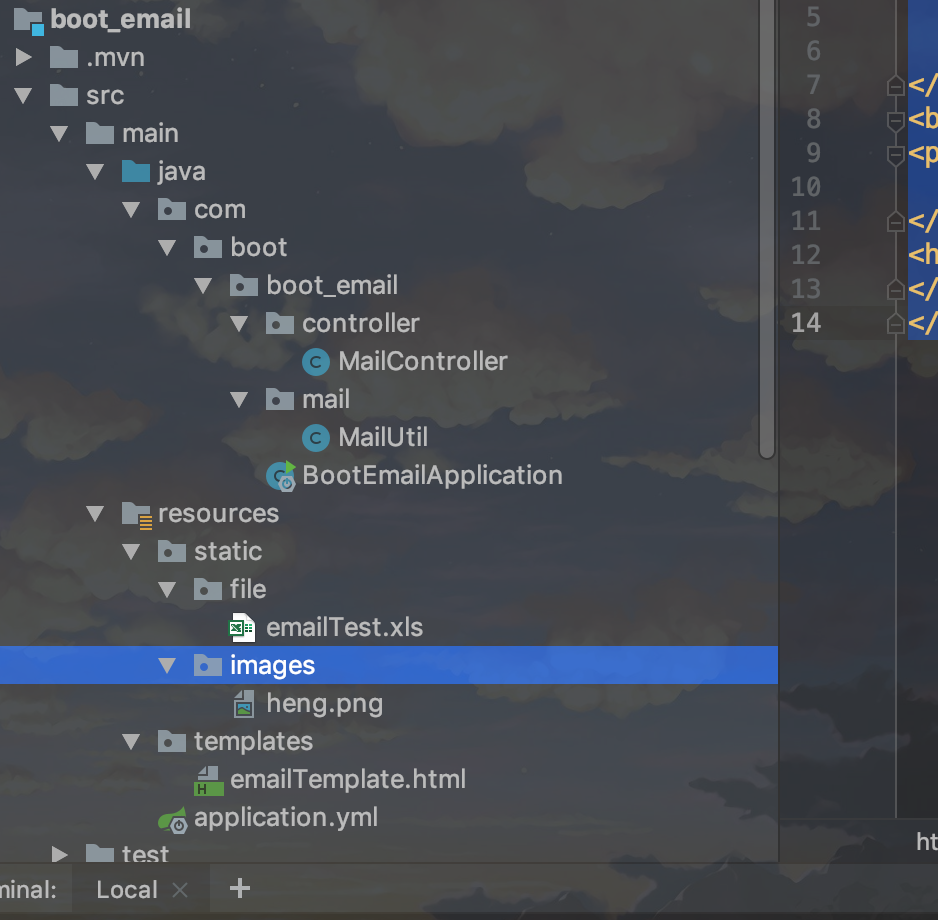
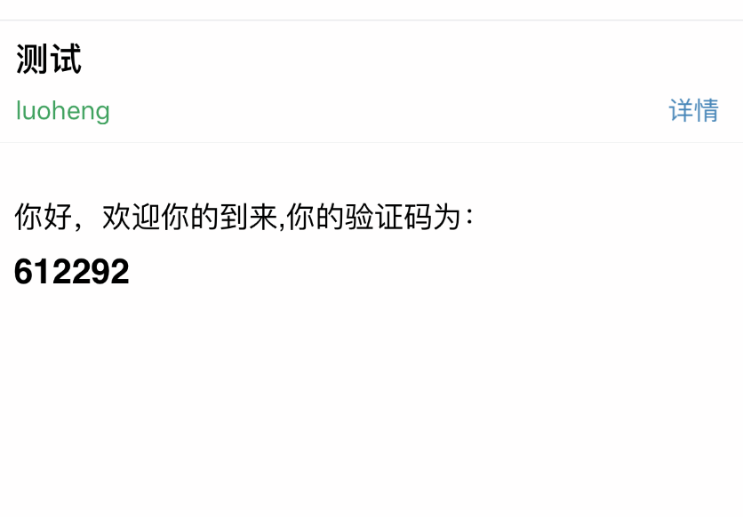
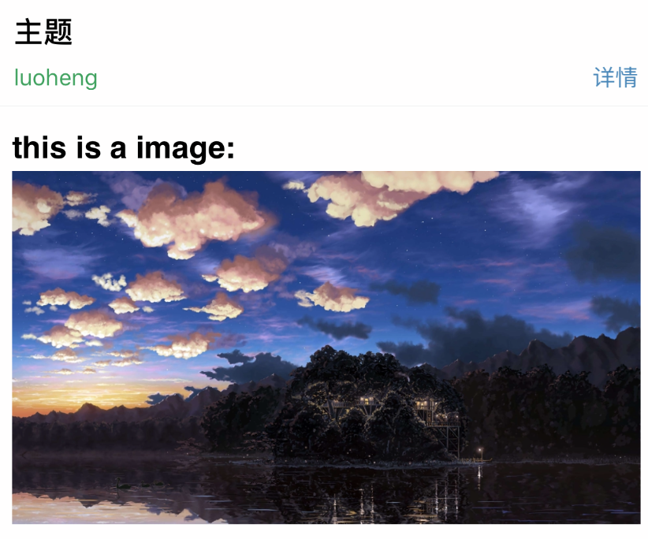
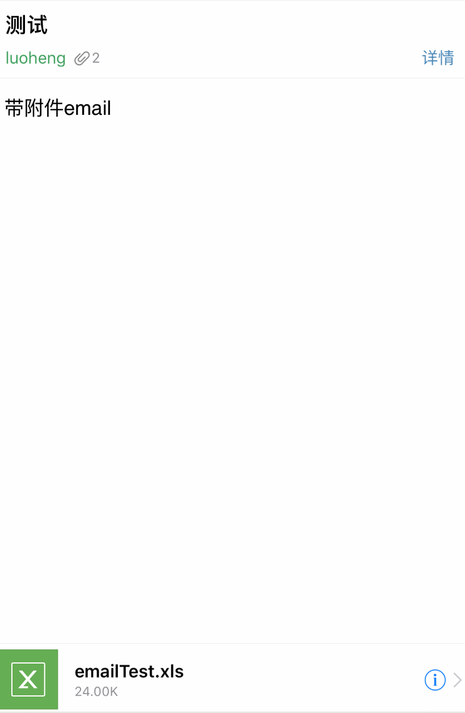

## springboot发送邮箱

spring Boot中发送邮件使用的是Spring提供的`org.springframework.mail.javamail.JavaMailSender`，其提供了许多简单易用的方法，可发送简单的邮件、HTML格式的邮件、带附件的邮件，并且可以创建邮件模板。

[项目地址](https://github.com/heng1234/springboot2.x/tree/master/boot_email):https://github.com/heng1234/springboot2.x/tree/master/boot_email

pom引入相关jar

```java
<!--邮件发送jar-->
<dependency>
    <groupId>org.springframework.boot</groupId>
    <artifactId>spring-boot-starter-mail</artifactId>
    <version>2.1.7.RELEASE</version>
</dependency>
<!--thymeleaf-->
<dependency>
    <groupId>org.springframework.boot</groupId>
    <artifactId>spring-boot-starter-thymeleaf</artifactId>
    <version>2.1.7.RELEASE</version>
</dependency>
```

application.yml

```yml
server:
  port: 7010
spring:
  mail:
    #email
    #SMTP服务器的名字
    host: smtp.mxhichina.com
    #发送人邮箱名称
    username: xxxx@qq.com
    #邮箱密码，这里指的是，在邮箱中打开SMTP/POP3验证之后，会给出一个验证码
    password: 123456
    #编码格式
    default-encoding: UTF-8
    #SMTP服务器开放的端口
    port: 465
    properties:
      mail:
        smtp:
          socketFactory:
            class: javax.net.ssl.SSLSocketFactory
```

MailUtil

```java

import org.springframework.beans.factory.annotation.Autowired;
import org.springframework.beans.factory.annotation.Value;
import org.springframework.core.io.FileSystemResource;
import org.springframework.mail.MailSender;
import org.springframework.mail.SimpleMailMessage;
import org.springframework.mail.javamail.JavaMailSender;
import org.springframework.mail.javamail.MimeMessageHelper;
import org.springframework.stereotype.Component;
import org.thymeleaf.TemplateEngine;
import org.thymeleaf.context.Context;
import javax.annotation.Resource;
import javax.mail.MessagingException;
import javax.mail.internet.MimeMessage;
import java.io.File;
import java.util.List;
import java.util.Map;
import java.util.Set;

/**
 * @author : kaifa
 * create at:  2019-11-11  13:48
 * @description: springboot集成发送邮箱根工具类
 */
@Component
public class MailUtil {


    @Value("${spring.mail.username}")
    private String from;

    @Autowired
    private JavaMailSender mailSender;

    @Autowired
    private MailSender sender;

    @Resource
    private TemplateEngine templateEngine;

    /**
     * 这是发送一个文本邮件
     * @param to 发送目标邮箱
     * @param subject 标题
     * @param content 内容
     * @throws Exception
     */
   
    public void sendSimpleMail(String to,String subject,String content) throws Exception{
        SimpleMailMessage mail =new SimpleMailMessage();
        mail.setTo(to);
        mail.setSubject(subject);
        mail.setText(content);
        mail.setFrom(from);
        sender.send(mail);
    }

    /**
     * 发送html邮件
     * @param to 目标邮箱
     * @param subject 标题
     * @param content 内容可以存放html
     * @throws Exception
     */
   
    public void sendHtmlMail(String to , String subject , String content) throws Exception{
        MimeMessage message =mailSender.createMimeMessage();
        try {
            MimeMessageHelper helper =new MimeMessageHelper(message,true);
            helper.setFrom(from);
            helper.setTo(to);
            helper.setSubject(subject);
            helper.setText(content,true);
            mailSender.send(message);
        } catch (MessagingException e) {
            e.printStackTrace();
        }
    }


    /**
     * 带有附件的邮件
     * @param to 接收地址
     * @param subject 标题
     * @param content 内容
     * @param filePath 文件路径
     * @throws Exception
     */
    public void sendOnlyAttachmentMail(String to ,String subject,String content , String filePath) throws Exception{

        MimeMessage message = mailSender.createMimeMessage();
        MimeMessageHelper helper = null;
        try {
            helper = new MimeMessageHelper(message,true);
            helper.setFrom(from);
            helper.setTo(to);
            helper.setSubject(subject);
            helper.setText(content,true);
            FileSystemResource file =new FileSystemResource(new File(filePath));
            String fileName = file.getFilename();
            helper.addAttachment(fileName,file);
            //helper.addAttachment(fileName+"_test",file);
            mailSender.send(message);
        } catch (MessagingException e) {
            e.printStackTrace();
        }

    }

    /**
     * 带有多个附件的邮件
     * @param to 目标邮箱
     * @param subject 标题
     * @param content 内容
     * @param filePathList 文件路径集合
     * @throws Exception
     */
   
    public void sendAttachmentsMail(String to , String subject, String content , List<String> filePathList) throws Exception{

        MimeMessage message = mailSender.createMimeMessage();
        MimeMessageHelper helper = null;
        try {
            helper = new MimeMessageHelper(message,true);
            helper.setFrom(from);
            helper.setTo(to);
            helper.setSubject(subject);
            helper.setText(content,true);
            FileSystemResource file = null;
            for(String filePath : filePathList){
                file =new FileSystemResource(new File(filePath));
                String fileName = file.getFilename();
                helper.addAttachment(fileName,file);
                helper.addAttachment(fileName+"_test",file);
            }

            mailSender.send(message);
        } catch (MessagingException e) {
            e.printStackTrace();
        }

    }

    /**
     * 带有图片的邮件
     * @param to 目标邮箱
     * @param subject 主题
     * @param content 内容
     * @param filePath 文件路径
     * @param srcId 图片id
     * @throws Exception
     */
   
    public void sendImageMail(String to ,String subject,String content , String filePath,String srcId) throws Exception{

        MimeMessage message = mailSender.createMimeMessage();
        MimeMessageHelper helper = null;
        try {
            helper = new MimeMessageHelper(message,true);
            helper.setFrom(from);
            helper.setTo(to);
            helper.setSubject(subject);
            helper.setText(content,true);
            FileSystemResource file =new FileSystemResource(new File(filePath));
            helper.addInline(srcId,file);
            mailSender.send(message);
        } catch (MessagingException e) {
            e.printStackTrace();
        }

    }

    /**
     *  携带多个图片的邮件
     * @param to 目标邮箱
     * @param subject 内容
     * @param content 内容
     * @param filePathList 文件路径集合
     * @param srcIdList 图片id集合
     * @throws Exception
     */
   
    public void sendImagesMail(String to ,String subject,String content , List<String> filePathList,List<String> srcIdList) throws Exception{

        MimeMessage message = mailSender.createMimeMessage();
        MimeMessageHelper helper = null;
        try {
            helper = new MimeMessageHelper(message,true);
            helper.setFrom(from);
            helper.setTo(to);
            helper.setSubject(subject);
            helper.setText(content,true);
            for(int i =0;i<srcIdList.size();i++){
                FileSystemResource file =new FileSystemResource(new File(filePathList.get(i)));
                helper.addInline(srcIdList.get(i),file);
            }

            mailSender.send(message);
        } catch (MessagingException e) {
            e.printStackTrace();
        }

    }

    /**
     * 使用html模版进行发送邮件
     * @param to 目标邮箱
     * @param subject 标题
     * @param map map 用于模板里读取map数据 模板读取比如th:text="${randomvalue}"
     * @param templateName 目标名称 比如emailTemplate对应emailTemplate.html
     * @throws Exception
     */
   
    public void sendTemplateMail(String to , String subject, Map<String,Object> map , String templateName) throws Exception{
        Context context = new Context();
        Set<String> keyList =map.keySet();
        for(String key:keyList){
            context.setVariable(key, map.get(key));
        }
        String templateContext = templateEngine.process(templateName,context);
        sendHtmlMail(to,subject,templateContext);
    }
}
```

测试MailController

```java


import com.boot.boot_email.mail.MailUtil;
import org.springframework.beans.factory.annotation.Autowired;
import org.springframework.util.ResourceUtils;
import org.springframework.web.bind.annotation.RequestMapping;
import org.springframework.web.bind.annotation.RestController;

import java.util.HashMap;
import java.util.Map;
import java.util.Random;

/**
 * @author : kaifa
 * create at:  2019-11-11  14:05
 * @description: email测试
 */
@RestController
@RequestMapping("email")
public class MailController {


    @Autowired
    private MailUtil mailUtil;

    /**
     * 发送邮件
     * @param email 邮箱
     * @param title 主题
     * @param context 内容
     * @throws Exception
     */
    @RequestMapping("simpleMail")
    public void sendSimpleMai(String email,String title,String context) throws Exception{
        mailUtil.sendSimpleMail(email,title,context);
    }

    /**
     * 发送图片
     * @param email 邮箱
     * @throws Exception
     */
    @RequestMapping("imgMail")
    public void sendImageMail(String email) throws Exception{

        String srcId = "harryImage";
        String htmlContent = "<html><body><h3>this is a image:</h3> </body></html>".replace("{srcId}",srcId);
        mailUtil.sendImageMail(email,"主题",htmlContent,ResourceUtils.getURL("classpath:static/images/heng.png").getPath(),srcId);
    }

    /**
     * 根据自定义模板发送 验证码
     * @param email
     * @throws Exception
     */
    @RequestMapping("tempMail")
    public  void sendTemplateMail(String email) throws Exception{
        Map<String,Object> map =new HashMap<>();
        map.put("randomvalue",new Random().nextInt(999999));
        mailUtil.sendTemplateMail(email,"测试",map,"emailTemplate");
    }

    /**
     * 发送邮件携带配件
     * @param email
     * @throws Exception
     */
    @RequestMapping("attachmentMail")
    public  void sendOnlyAttachmentMail(String email) throws Exception{
        mailUtil.sendOnlyAttachmentMail(email,"测试","带附件email",ResourceUtils.getURL("classpath:static/file/emailTest.xls").getPath());
    }
}
```

emailTemplate.html

```html
<!DOCTYPE html>
<html lang="en" xmlns:th="http://www.thymeleaf.org">
<head>
    <meta charset="UTF-8">
    <title>邮件模版</title>
</head>
<body>
<p>
    你好，欢迎你的到来,你的验证码为：
</p>
<h3 th:text="${randomvalue}"></h3>
</body>
</html>
```

项目结构



自定义模板访问:http://localhost:7010/email/tempMail?email=1350047452@qq.com



发送图片访问:http://localhost:7010/email/imgMail?email=1350047452@qq.com



带附件访问:http://localhost:7010/email/attachmentMail?email=1350047452@qq.com





下一章:[springboot使用swagger2](../swagger2/swagger2.md)

