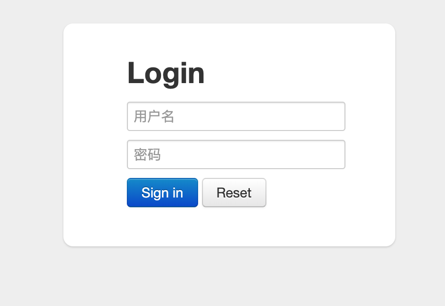
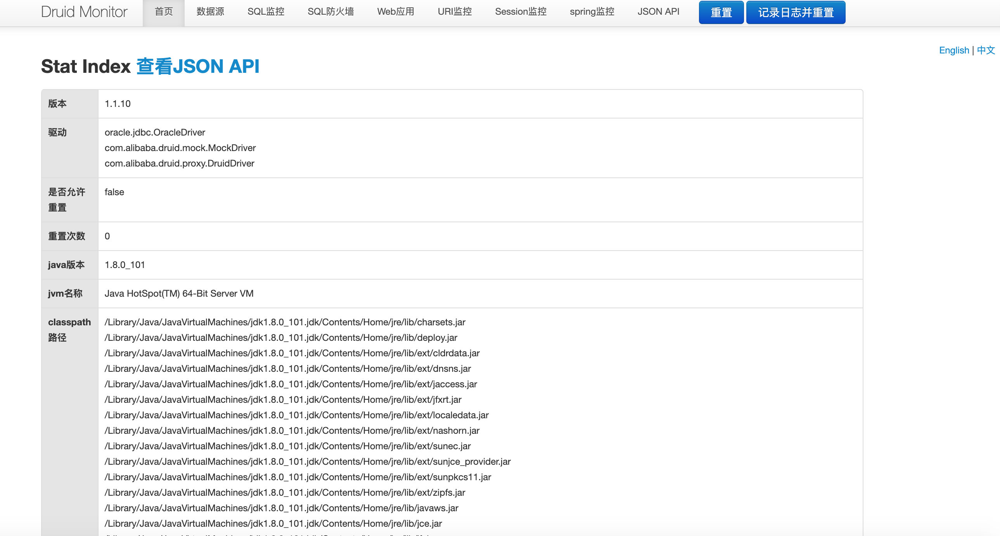
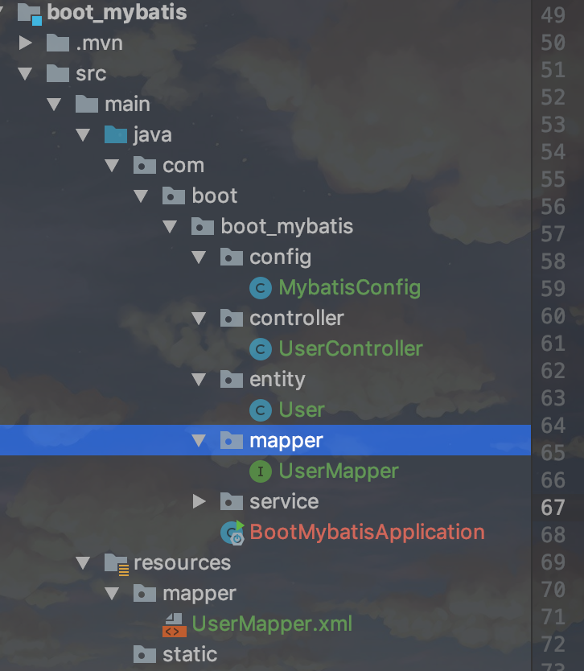
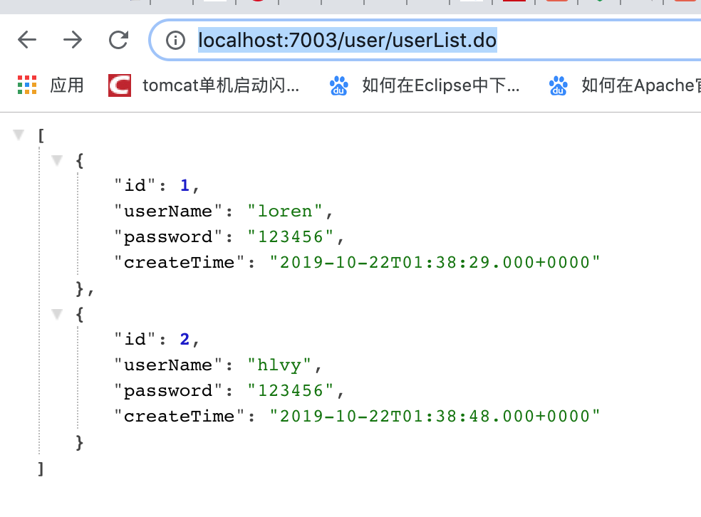
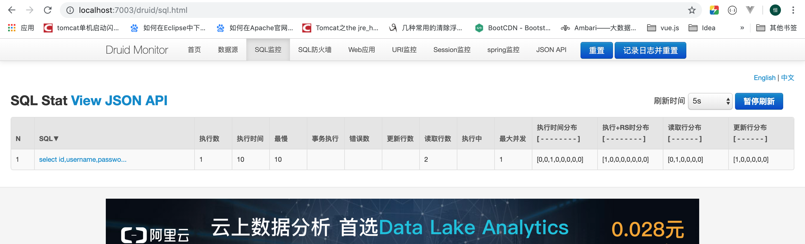

# Springboot2.x集成mybatis(druid+xml方式)

**[项目地址](https://github.com/heng1234/springboot2.x/tree/master/boot_mybatis)**:https://github.com/heng1234/springboot2.x/tree/master/boot_mybatis

**整合MyBatis之前，先搭建一个基本的Spring Boot项目[项目创建地址](https://start.spring.io/)。这里使用关系型数据库Oracle 11g**

创建数据表t_user

```sql
CREATE TABLE  "T_USER"

(    "ID" NUMBER(20,0) NOT NULL ENABLE,

    "USERNAME" VARCHAR2(50),

    "PASSWORD" VARCHAR2(50),

    "CREATE_TIME" DATE

) SEGMENT CREATION IMMEDIATE

PCTFREE 10 PCTUSED 40 INITRANS 1 MAXTRANS 255 NOCOMPRESS LOGGING

STORAGE(INITIAL 65536 NEXT 1048576 MINEXTENTS 1 MAXEXTENTS 2147483645

PCTINCREASE 0 FREELISTS 1 FREELIST GROUPS 1 BUFFER_POOL DEFAULT FLASH_CACHE DEFAULT CELL_FLASH_CACHE DEFAULT)

TABLESPACE "SYSTEM" 


```

```sql
INSERT INTO "BOOT"."user"("ID", "USERNAME", "PASSWORD", "CREATE_TIME") VALUES ('1', 'loren', '123456', TO_DATE('2019-10-22 09:38:29', 'SYYYY-MM-DD HH24:MI:SS'));
    
INSERT INTO "BOOT"."user"("ID", "USERNAME", "PASSWORD", "CREATE_TIME") VALUES ('2', 'hlvy', '123456', TO_DATE('2019-10-22 09:38:48', 'SYYYY-MM-DD HH24:MI:SS'));
```

Pom.xml文件引入jar

```xml
<!-- oracle驱动 -->
<dependency>
    <groupId>com.oracle</groupId>
    <artifactId>ojdbc6</artifactId>
    <version>11.2.0.4</version>
</dependency>
<!--alibaba druid-->
<dependency>
    <groupId>com.alibaba</groupId>
    <artifactId>druid-spring-boot-starter</artifactId>
    <version>1.1.10</version>
</dependency>
<!--lombok插件-->
<dependency>
    <groupId>org.projectlombok</groupId>
    <artifactId>lombok</artifactId>
    <version>1.18.10</version>
    <optional>true</optional>
</dependency>
```

集成druid application.yml配置

```yml
server:
  port: 7003
spring:
  datasource:
    druid:
      # 数据库访问配置, 使用druid数据源
      # 数据源 oracle
      type: com.alibaba.druid.pool.DruidDataSource
      driver-class-name: oracle.jdbc.driver.OracleDriver
      url: jdbc:oracle:thin:@localhost:49161:XE
      username: boot
      password: 123456

      # 连接池配置
      initial-size: 5
      min-idle: 5
      max-active: 20
      # 连接等待超时时间
      max-wait: 30000
      # 配置检测可以关闭的空闲连接间隔时间
      time-between-eviction-runs-millis: 60000
      # 配置连接在池中的最小生存时间
      min-evictable-idle-time-millis: 300000
      validation-query: select '1' from dual
      test-while-idle: true
      test-on-borrow: false
      test-on-return: false
      # 打开PSCache，并且指定每个连接上PSCache的大小
      pool-prepared-statements: true
      max-open-prepared-statements: 20
      max-pool-prepared-statement-per-connection-size: 20
      # 配置监控统计拦截的filters, 去掉后监控界面sql无法统计, 'wall'用于防火墙
      filters: stat,wall
      # Spring监控AOP切入点，如x.y.z.service.*,配置多个英文逗号分隔
      aop-patterns: com.boot.boot_mybatis.service.*


      # WebStatFilter配置
      web-stat-filter:
        enabled: true
        # 添加过滤规则
        url-pattern: /*
        # 忽略过滤的格式
        exclusions: '*.js,*.gif,*.jpg,*.png,*.css,*.ico,/druid/*'

      # StatViewServlet配置
      stat-view-servlet:
        enabled: true
        # 访问路径为/druid时，跳转到StatViewServlet
        url-pattern: /druid/*
        # 是否能够重置数据
        reset-enable: false
        # 需要账号密码才能访问控制台
        login-username: druid
        login-password: 123456
        # IP白名单
        # allow: 127.0.0.1
        #　IP黑名单（共同存在时，deny优先于allow）
        # deny: 192.168.1.218

      # 配置StatFilter
      filter:
        stat:
          log-slow-sql: true
#showSql
logging:
  level:
    com:
      boot:
        boot_mybatis:
          mapper: debug
```

启动项目访问http://localhost:7003/druid/login.html 出现



用户名密码是配置文件配置的  用户名 druid 密码123456 

登录进来会看到这个页面

    


集成mybatis

pom文件引入xmyabtis包

```xml

<!--mybatis-->
<dependency>
    <groupId>org.mybatis.spring.boot</groupId>
    <artifactId>mybatis-spring-boot-starter</artifactId>
    <version>1.3.1</version>
</dependency>
```

创建 entity  mapper controller service 以及resource创建mapper存储mapper xml文件

项目结构



application.yml加入

```yml
mybatis:
#扫描mapper xml
  mapper-locations: classpath:mapper/*.xml
#扫描实体类
  type-aliases-package: com.boot.boot_mybatis.entity
```

创建MybatisConfig用于扫描mapper接口

```java
import org.mybatis.spring.annotation.MapperScan;
import org.springframework.context.annotation.Configuration;

/**
 * @author : kaifa
 * create at:  2019-10-22  10:03
 * @description: mybatis配置类
 */
@Configuration
@MapperScan("com.boot.boot_mybatis.mapper")
public class MybatisConfig {
}
```

UserMapper.xml

```xml
<?xml version="1.0" encoding="UTF-8" ?>
<!DOCTYPE mapper PUBLIC "-//mybatis.org//DTD Mapper 3.0//EN"
        "http://mybatis.org/dtd/mybatis-3-mapper.dtd">
<mapper namespace="com.boot.boot_mybatis.mapper.UserMapper">

    <select id="selectListAll" resultType="com.boot.boot_mybatis.entity.User">
      select id,username,password,create_time createTime from t_user
    </select>
</mapper>
```

UserMapper

```java
import com.boot.boot_mybatis.entity.User;

import java.util.List;

/**
 * @author : kaifa
 * create at:  2019-10-22  10:10
 * @description: user mapper接口
 */
public interface UserMapper {

    /**查询所有用户*/
    List<User> selectListAll();
}
```

UserService

```java
import com.boot.boot_mybatis.entity.User;
import com.boot.boot_mybatis.mapper.UserMapper;
import org.springframework.beans.factory.annotation.Autowired;
import org.springframework.stereotype.Service;

import java.util.List;

/**
 * @author : kaifa
 * create at:  2019-10-22  10:10
 * @description: user 业务层
 */
@Service
public class UserService {

    @Autowired
    private UserMapper userMapper;


    /**
     * 查询所有用户
     * @return
     */
   public List<User> selectListAll(){
        return userMapper.selectListAll();
    }
}
```

controller

```java
import com.boot.boot_mybatis.entity.User;
import com.boot.boot_mybatis.service.UserService;
import org.springframework.beans.factory.annotation.Autowired;
import org.springframework.web.bind.annotation.RequestMapping;
import org.springframework.web.bind.annotation.RestController;

import java.util.List;

/**
 * @author : kaifa
 * create at:  2019-10-22  10:16
 * @description: user controller
 */
@RestController
@RequestMapping("user")
public class UserController {

    @Autowired
    private UserService userService;

    /**
     * 查询所有用户
     * @return
     */
    @RequestMapping("userList.do")
    List<User> selectListAll(){
        return userService.selectListAll();
    }
}
```

浏览器访问http://localhost:7003/user/userList.do



查看druid监控

