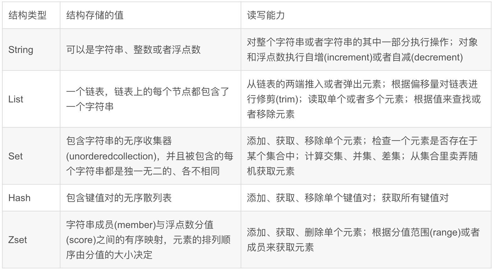
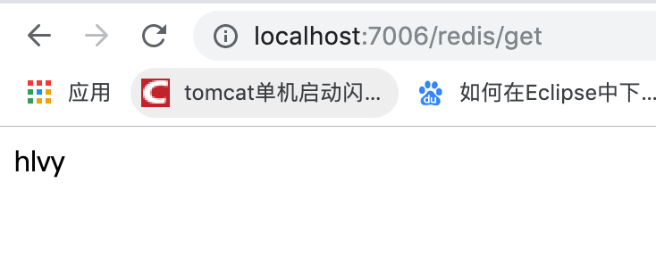

# SpringBoot 中使用Redis缓存

  在项目中对数据的访问往往都是直接访问数据库的方式，但如果对数据的访问量很大或者访问很频繁的话，将会对数据库来很大的压力，甚至造成数据库崩溃。为了解决这类问题redis数据库脱颖而出，redis数据库出现时是以非关系数据库的光环展示在广大程序猿的面前的，后来redis的迭代版本支持了缓存数据、登录session状态（分布式session共享）等。所以又被作为内存缓存的形式应用到大型企业级项目中。

**1、Redis简单介绍**

```txt
Redis 是完全开源免费的，遵守BSD协议，是一个高性能的key-value非关系性数据库(NoSql)。
    Redis 与其他 key - value 缓存产品有以下三个特点：

    Redis支持数据的持久化，可以将内存中的数据保存在磁盘中，重启的时候可以再次加载进行使用。
    Redis不仅仅支持简单的key-value类型的数据，同时还提供list，set，zset，hash等数据结构的存储。
    Redis支持数据的备份，即master-slave模式的数据备份。
```

Redis可以存储键与5种不同数据结构类型之间的映射，这5种数据结构类型分别为 String（字符串）、List（列表）、Set（集合）、Hash（散列）和 Zset（有序集合）。

**2.2 Redis 优势**

```txt
性能极高 – Redis能读的速度是110000次/s,写的速度是81000次/s 。
        丰富的数据类型 – Redis支持二进制案例的 Strings, Lists, Hashes, Sets 及 Ordered Sets 数据类型操作。
        原子 – Redis的所有操作都是原子性的，意思就是要么成功执行要么失败完全不执行。单个操作是原子性的。多个操作也支持事务，即原子性，通过MULTI和EXEC指令包起来。
        丰富的特性 – Redis还支持 publish/subscribe, 通知, key 过期等等特性。
```

**2.3 Redis与其他key-value存储有什么不同？**

```
Redis有着更为复杂的数据结构并且提供对他们的原子性操作，这是一个不同于其他数据库的进化路径。Redis的数据类型都是基于基本数据结构的同时对程序员透明，无需进行额外的抽象。
        Redis运行在内存中但是可以持久化到磁盘，所以在对不同数据集进行高速读写时需要权衡内存，因为数据量不能大于硬件内存。在内存数据库方面的另一个优点是，相比在磁盘上相同的复杂的数据结构，在内存中操作起来非常简单，这样Redis可以做很多内部复杂性很强的事情。同时，在磁盘格式方面他们是紧凑的以追加的方式产生的，因为他们并不需要进行随机访问。
```

###### 添加Redis依赖包

在项目的pom.xml中添加如下：

```xml
<dependency>
    <groupId>org.springframework.boot</groupId>
    <artifactId>spring-boot-starter-data-redis</artifactId>
</dependency>
```

application.yml：

```yml
spring:
  #redis配置
  redis:
    #redis密码
    password: 123456
    #Redis服务器地址
    host: 127.0.0.1
    #Redis服务器连接端口
    port: 6379
    #连接超时时间（毫秒）
    timeout: 5000
    #Redis数据库索引（默认为0）
    database: 1
    jedis:
      pool:
        #连接池最大连接数（使用负值表示没有限制）
        max-active: 50
        #连接池最大阻塞等待时间（使用负值表示没有限制）
        max-wait: 3000
        #连接池中的最大空闲连接
        max-idle: 20
        #连接池中的最小空闲连接
        min-idle: 2
server:
  port: 7006
```

接着配置redis序列号等

RedisConfig：

```java


import com.fasterxml.jackson.annotation.JsonAutoDetect;
import com.fasterxml.jackson.annotation.PropertyAccessor;
import com.fasterxml.jackson.databind.ObjectMapper;
import org.springframework.context.annotation.Bean;
import org.springframework.context.annotation.Configuration;
import org.springframework.data.redis.connection.RedisConnectionFactory;
import org.springframework.data.redis.core.RedisTemplate;
import org.springframework.data.redis.serializer.Jackson2JsonRedisSerializer;
import org.springframework.data.redis.serializer.StringRedisSerializer;

/**
 * @author : hlvy
 * create at:  2019-10-14  11:33
 * @description: redis配置类
 */
@Configuration
public class RedisConfig {
    @Bean
    @SuppressWarnings("all")
    public RedisTemplate<String, Object> redisTemplate(RedisConnectionFactory factory) {
        RedisTemplate<String, Object> template = new RedisTemplate<String, Object>();
        template.setConnectionFactory(factory);
        Jackson2JsonRedisSerializer jackson2JsonRedisSerializer = new Jackson2JsonRedisSerializer(Object.class);
        ObjectMapper om = new ObjectMapper();
        om.setVisibility(PropertyAccessor.ALL, JsonAutoDetect.Visibility.ANY);
        om.enableDefaultTyping(ObjectMapper.DefaultTyping.NON_FINAL);
        jackson2JsonRedisSerializer.setObjectMapper(om);
        StringRedisSerializer stringRedisSerializer = new StringRedisSerializer();
        // key采用String的序列化方式
        template.setKeySerializer(stringRedisSerializer);
        // hash的key也采用String的序列化方式
        template.setHashKeySerializer(stringRedisSerializer);
        // value序列化方式采用jackson
        template.setValueSerializer(jackson2JsonRedisSerializer);
        // hash的value序列化方式采用jackson
        template.setHashValueSerializer(jackson2JsonRedisSerializer);
        template.afterPropertiesSet();
        return template;
    }
}
```


RedisUtil：

```java
import org.springframework.beans.factory.annotation.Autowired;
import org.springframework.data.redis.core.RedisTemplate;
import org.springframework.stereotype.Component;
import org.springframework.util.CollectionUtils;

import java.util.List;
import java.util.Map;
import java.util.Set;
import java.util.concurrent.TimeUnit;

/**
 * @author : kaifa
 * create at:  --  :
 * @description: redis工具类
 */
@Component
public class RedisUtil {

    @Autowired
    private RedisTemplate<String, Object> redisTemplate;
        // =============================common============================
        /**
         * 指定缓存失效时间
         * @param key 键
         * @param time 时间(秒)
         * @return
         */
    public boolean expire(String key, long time) {
        try {
            if (time > 0) {
                redisTemplate.expire(key, time, TimeUnit.SECONDS);
            }
            return true;
        } catch (Exception e) {
            e.printStackTrace();
            return false;
        }
    }
        /**
         * 根据key 获取过期时间
         * @param key 键 不能为null
         * @return 时间(秒) 返回0代表为永久有效
         */
    public long getExpire(String key) {
        return redisTemplate.getExpire(key, TimeUnit.SECONDS);
    }
        /**
         * 判断key是否存在
         * @param key 键
         * @return true 存在 false不存在
         */
    public boolean hasKey(String key) {
        try {
            return redisTemplate.hasKey(key);
        } catch (Exception e) {
            e.printStackTrace();
            return false;
        }
    }
        /**
         * 删除缓存
         * @param key 可以传一个值 或多个
         */
    @SuppressWarnings("unchecked")
    public void del(String... key) {
        if (key != null && key.length > 0) {
            if (key.length == 1) {
                redisTemplate.delete(key[0]);
            } else {
                redisTemplate.delete(CollectionUtils.arrayToList(key));
            }
        }
    }
        // ============================String=============================
        /**
         * 普通缓存获取
         * @param key 键
         * @return 值
         */
    public Object get(String key) {
        return key == null ? null : redisTemplate.opsForValue().get(key);
    }
        /**
         * 普通缓存放入
         * @param key 键
         * @param value 值
         * @return true成功 false失败
         */
    public boolean set(String key, Object value) {
        try {
            redisTemplate.opsForValue().set(key, value);
            return true;
        } catch (Exception e) {
            e.printStackTrace();
            return false;
        }
    }
        /**
         * 普通缓存放入并设置时间
         * @param key 键
         * @param value 值
         * @param time 时间(秒) time要大于0 如果time小于等于0 将设置无限期
         * @return true成功 false 失败
         */
    public boolean set(String key, Object value, long time) {
        try {
            if (time > 0) {
                redisTemplate.opsForValue().set(key, value, time, TimeUnit.SECONDS);
            } else {
                set(key, value);
            }
            return true;
        } catch (Exception e) {
            e.printStackTrace();
            return false;
        }
    }
        /**
         * 递增
         * @param key 键
         * @param delta 要增加几(大于0)
         * @return
         */
    public long incr(String key, long delta) {
        if (delta < 0) {
            throw new RuntimeException("递增因子必须大于0");
        }
        return redisTemplate.opsForValue().increment(key, delta);
    }
        /**
         * 递减
         * @param key 键
         * @param delta 要减少几(小于0)
         * @return
         */
    public long decr(String key, long delta) {
        if (delta < 0) {
            throw new RuntimeException("递减因子必须大于0");
        }
        return redisTemplate.opsForValue().increment(key, -delta);
    }
        // ================================Map=================================
        /**
         * HashGet
         * @param key 键 不能为null
         * @param item 项 不能为null
         * @return 值
         */
    public Object hget(String key, String item) {
        return redisTemplate.opsForHash().get(key, item);
    }
        /**
         * 获取hashKey对应的所有键值
         * @param key 键
         * @return 对应的多个键值
         */
    public Map<Object, Object> hmget(String key) {
        return redisTemplate.opsForHash().entries(key);
    }
        /**
         * HashSet
         * @param key 键
         * @param map 对应多个键值
         * @return true 成功 false 失败
         */
    public boolean hmset(String key, Map<String, Object> map) {
        try {
            redisTemplate.opsForHash().putAll(key, map);
            return true;
        } catch (Exception e) {
            e.printStackTrace();
            return false;
        }
    }
        /**
         * HashSet 并设置时间
         * @param key 键
         * @param map 对应多个键值
         * @param time 时间(秒)
         * @return true成功 false失败
         */
    public boolean hmset(String key, Map<String, Object> map, long time) {
        try {
            redisTemplate.opsForHash().putAll(key, map);
            if (time > 0) {
                expire(key, time);
            }
            return true;
        } catch (Exception e) {
            e.printStackTrace();
            return false;
        }
    }
        /**
         * 向一张hash表中放入数据,如果不存在将创建
         * @param key 键
         * @param item 项
         * @param value 值
         * @return true 成功 false失败
         */
    public boolean hset(String key, String item, Object value) {
        try {
            redisTemplate.opsForHash().put(key, item, value);
            return true;
        } catch (Exception e) {
            e.printStackTrace();
            return false;
        }
    }
        /**
         * 向一张hash表中放入数据,如果不存在将创建
         * @param key 键
         * @param item 项
         * @param value 值
         * @param time 时间(秒) 注意:如果已存在的hash表有时间,这里将会替换原有的时间
         * @return true 成功 false失败
         */
    public boolean hset(String key, String item, Object value, long time) {
        try {
            redisTemplate.opsForHash().put(key, item, value);
            if (time > 0) {
                expire(key, time);
            }
            return true;
        } catch (Exception e) {
            e.printStackTrace();
            return false;
        }
    }
        /**
         * 删除hash表中的值
         * @param key 键 不能为null
         * @param item 项 可以使多个 不能为null
         */
    public void hdel(String key, Object... item) {
        redisTemplate.opsForHash().delete(key, item);
    }
        /**
         * 判断hash表中是否有该项的值
         * @param key 键 不能为null
         * @param item 项 不能为null
         * @return true 存在 false不存在
         */
    public boolean hHasKey(String key, String item) {
        return redisTemplate.opsForHash().hasKey(key, item);
    }
        /**
         * hash递增 如果不存在,就会创建一个 并把新增后的值返回
         * @param key 键
         * @param item 项
         * @param by 要增加几(大于0)
         * @return
         */
    public double hincr(String key, String item, double by) {
        return redisTemplate.opsForHash().increment(key, item, by);
    }
        /**
         * hash递减
         * @param key 键
         * @param item 项
         * @param by 要减少记(小于0)
         * @return
         */
    public double hdecr(String key, String item, double by) {
        return redisTemplate.opsForHash().increment(key, item, -by);
    }
        // ============================set=============================
        /**
         * 根据key获取Set中的所有值
         * @param key 键
         * @return
         */
    public Set<Object> sGet(String key) {
        try {
            return redisTemplate.opsForSet().members(key);
        } catch (Exception e) {
            e.printStackTrace();
            return null;
        }
    }
        /**
         * 根据value从一个set中查询,是否存在
         * @param key 键
         * @param value 值
         * @return true 存在 false不存在
         */
    public boolean sHasKey(String key, Object value) {
        try {
            return redisTemplate.opsForSet().isMember(key, value);
        } catch (Exception e) {
            e.printStackTrace();
            return false;
        }
    }
        /**
         * 将数据放入set缓存
         * @param key 键
         * @param values 值 可以是多个
         * @return 成功个数
         */
    public long sSet(String key, Object... values) {
        try {
            return redisTemplate.opsForSet().add(key, values);
        } catch (Exception e) {
            e.printStackTrace();
            return 0;
        }
    }
        /**
         * 将set数据放入缓存
         * @param key 键
         * @param time 时间(秒)
         * @param values 值 可以是多个
         * @return 成功个数
         */
    public long sSetAndTime(String key, long time, Object... values) {
        try {
            Long count = redisTemplate.opsForSet().add(key, values);
            if (time > 0) {
                expire(key, time);
            }
                return count;

        } catch (Exception e) {
            e.printStackTrace();
            return 0;
        }
    }
        /**
         * 获取set缓存的长度
         * @param key 键
         * @return
         */
    public long sGetSetSize(String key) {
        try {
            return redisTemplate.opsForSet().size(key);
        } catch (Exception e) {
            e.printStackTrace();
            return 0;
        }
    }
        /**
         * 移除值为value的
         * @param key 键
         * @param values 值 可以是多个
         * @return 移除的个数
         */
    public long setRemove(String key, Object... values) {
        try {
            Long count = redisTemplate.opsForSet().remove(key, values);
            return count;
        } catch (Exception e) {
            e.printStackTrace();
            return 0;
        }
    }
        // ===============================list=================================
        /**
         * 获取list缓存的内容
         * @param key 键
         * @param start 开始
         * @param end 结束 0 到 -1代表所有值
         * @return
         */
    public List<Object> lGet(String key, long start, long end) {
        try {
            return redisTemplate.opsForList().range(key, start, end);
        } catch (Exception e) {
            e.printStackTrace();
            return null;
        }
    }
        /**
         * 获取list缓存的长度
         * @param key 键
         * @return
         */
    public long lGetListSize(String key) {
        try {
            return redisTemplate.opsForList().size(key);
        } catch (Exception e) {
            e.printStackTrace();
            return 0;
        }
    }
        /**
         * 通过索引 获取list中的值
         * @param key 键
         * @param index 索引 index>=0时， 0 表头，1 第二个元素，依次类推；index<0时，-1，表尾，-2倒数第二个元素，依次类推
         * @return
         */
    public Object lGetIndex(String key, long index) {
        try {
            return redisTemplate.opsForList().index(key, index);
        } catch (Exception e) {
            e.printStackTrace();
            return null;
        }
    }
        /**
         * 将list放入缓存
         * @param key 键
         * @param value 值
         * @return
         */
    public boolean lSet(String key, Object value) {
        try {
            redisTemplate.opsForList().rightPush(key, value);
            return true;
        } catch (Exception e) {
            e.printStackTrace();
            return false;
        }
    }
        /**
         * 将list放入缓存
         * @param key 键
         * @param value 值
         * @param time 时间(秒)
         * @return
         */
    public boolean lSet(String key, Object value, long time) {
        try {
            redisTemplate.opsForList().rightPush(key, value);
            if (time > 0) {
                expire(key, time);
            }
            return true;
        } catch (Exception e) {
            e.printStackTrace();
            return false;
        }
    }
        /**
         * 将list放入缓存
         * @param key 键
         * @param value 值
         * @return
         */
    public boolean lSet(String key, List<Object> value) {
        try {
            redisTemplate.opsForList().rightPushAll(key, value);
            return true;
        } catch (Exception e) {
            e.printStackTrace();
            return false;
        }
    }
        /**
         * 将list放入缓存
         *
         * @param key 键
         * @param value 值
         * @param time 时间(秒)
         * @return
         */
    public boolean lSet(String key, List<Object> value, long time) {
        try {
            redisTemplate.opsForList().rightPushAll(key, value);
            if (time > 0) {
                expire(key, time);
            }
            return true;
        } catch (Exception e) {
            e.printStackTrace();
            return false;
        }
    }
        /**
         * 根据索引修改list中的某条数据
         * @param key 键
         * @param index 索引
         * @param value 值
         * @return
         */
    public boolean lUpdateIndex(String key, long index, Object value) {
        try {
            redisTemplate.opsForList().set(key, index, value);
            return true;
        } catch (Exception e) {
            e.printStackTrace();
            return false;
        }
    }
        /**
         * 移除N个值为value
         * @param key 键
         * @param count 移除多少个
         * @param value 值
         * @return 移除的个数
         */
    public long lRemove(String key, long count, Object value) {
        try {
            Long remove = redisTemplate.opsForList().remove(key, count, value);
            return remove;
        } catch (Exception e) {
            e.printStackTrace();
            return 0;
        }
    }
}
```

测试RedisController

```java

import com.boot.boot_redis.util.RedisUtil;
import org.springframework.beans.factory.annotation.Autowired;
import org.springframework.web.bind.annotation.RequestMapping;
import org.springframework.web.bind.annotation.RestController;

/**
 * @author : kaifa
 * create at:  2019-10-28  14:22
 * @description: 测试redis
 */
@RestController
@RequestMapping("redis")
public class RedisController {

    @Autowired
    private RedisUtil redisUtil;

    final String key = "rdsname";
    @RequestMapping("set")
    public String setKey(String name){
        redisUtil.set(key,name,7200);
        return "success";
    }

    @RequestMapping("get")
    public String getKey(){
      if (redisUtil.hasKey(key))
          return redisUtil.get(key) + "";

      return "";

    }
}
```

访问：http://localhost:7006/redis/set?name=hlvy

接着访问:http://localhost:7006/redis/get



