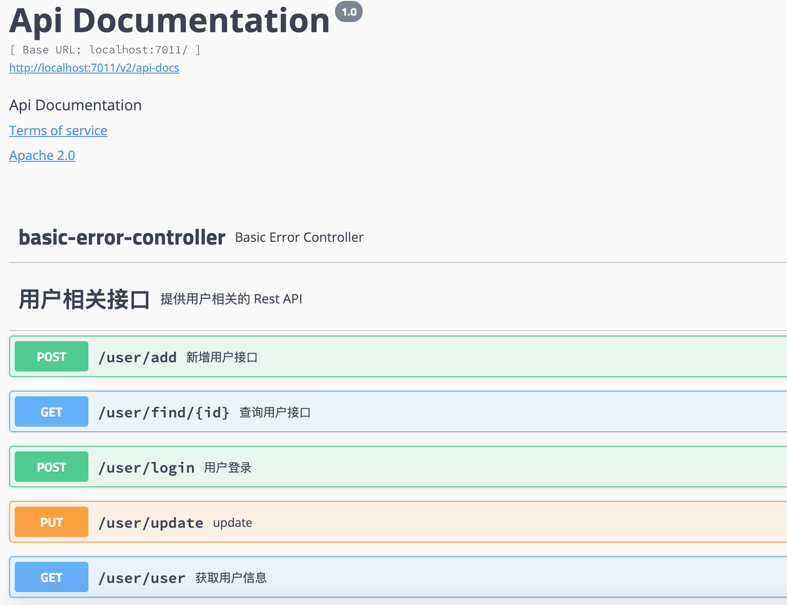

## springboot使用swagger2生成文档

Swagger 是一套基于 OpenAPI 规范构建的开源工具，可以帮助我们设计、构建、记录以及使用 Rest API。


使用swagger2需要在pom加入jar

```xml
<!--swagger2-->
<dependency>
    <groupId>io.springfox</groupId>
    <artifactId>springfox-swagger2</artifactId>
    <version>2.9.2</version>
</dependency>
<dependency>
    <groupId>io.springfox</groupId>
    <artifactId>springfox-swagger-ui</artifactId>
    <version>2.9.2</version>
</dependency>
```

接着配置swagger

```java
import com.google.common.base.Predicates;
import org.springframework.context.annotation.Bean;
import org.springframework.context.annotation.Configuration;
import org.springframework.context.annotation.Profile;
import org.springframework.web.bind.annotation.RequestMethod;
import springfox.documentation.builders.PathSelectors;
import springfox.documentation.builders.RequestHandlerSelectors;
import springfox.documentation.builders.ResponseMessageBuilder;
import springfox.documentation.schema.ModelRef;
import springfox.documentation.service.ApiInfo;
import springfox.documentation.service.Contact;
import springfox.documentation.spi.DocumentationType;
import springfox.documentation.spring.web.plugins.Docket;
import springfox.documentation.swagger2.annotations.EnableSwagger2;

import java.util.Collections;

import static com.google.common.collect.Lists.newArrayList;

/**
 * 
 * 一般引入类的方式：import java.lang.Math.*;
 * <p>
 * 静态引入类的方式：import static java.lang.Math.*;
 * <p>
 * 区别在于：
 * 一般引入需要使用 ClassName.method(); 的方式去调用类中的静态方法；
 * 而静态引入后，直接使用 method(); 即可使用静态方法。
 */
/**
 * @author : kaifa
 * create at:  2019-11-13  11:01
 * @description: swagger配置类
 */
// @Configuration 是告诉 Spring Boot 需要加载这个配置类
@Configuration
//@EnableSwagger2 是启用 Swagger2
@EnableSwagger2
public class SwaggerConfig {
    /**
     * Java 配置
     * Springfox 提供了一个 Docket 对象，让我们可以灵活的配置 Swagger 的各项属性。
     * 下面我们新建一个 SwaggerConfig.java 类，并增加如下内容:
     * @return
     */
    @Bean
    @Profile({"dev","test"})// 设置 dev test 环境开启
    public Docket api() {
        return new Docket(DocumentationType.SWAGGER_2)
                .select()
                .apis(RequestHandlerSelectors.basePackage("com.boot.boot_swagger2.controller"))

                /**
                 * 在 Docket 上增加筛选。Docket 类提供了 apis() 和 paths()两 个方法来帮助我们在不同级别上过滤接口：
                 * apis()：这种方式我们可以通过指定包名的方式，让 Swagger 只去某些包下面扫描。
                 * paths()：这种方式可以通过筛选 API 的 url 来进行过滤。
                 * 在集成 Swagger2 的章节中我们这两个方法指定的都是扫描所有，没有指定任何过滤条件。
                 * 如果我们在我们修改之前定义的 Docket 对象的 apis() 方法和 paths() 方法为下面的内容，
                 * 那么接口文档将只会展示 /userinfo/add 和 /user/** user下的所有接口 。
                 *
                 * 使用 Docket 配置接口筛选
                 */

                .paths(Predicates.or(PathSelectors.ant("/userinfo/add"),
                        PathSelectors.ant("/user/**")))
                .build()
                /**
                 * 文档信息配置，Swagger 还支持设置一些文档的版本号、联系人邮箱、网站、版权、开源协议等等信息，
                 * 但与上面几条不同的是这些信息不是通过注解配置，
                 * 而是通过创建一个 ApiInfo 对象，并且使用 Docket.appInfo() 方法来设置，
                 * 我们在 SwaggerConfig.java 类中新增如下内容即可。
                 * @return
                 */
                .apiInfo(apiInfo())

                /**
                 * 自定义响应消息
                 * Swagger 允许我们通过 Docket 的 globalResponseMessage()
                 * 方法全局覆盖 HTTP 方法的响应消息，但是首先我们得通过 Docket 的 useDefaultResponseMessages
                 * 方法告诉 Swagger 不使用默认的 HTTP 响应消息，
                 * 假设我们现在需要覆盖所有 GET 方法的 500 和 403 错误的响应消息，
                 * 我们只需要在 SwaggerConfig.java 类中的 Docket Bean 下添加如下内容：
                 * 添加如上面的代码后，您会发现在 SwaggerUI
                 * 页面展示的所有 GET 类型请求的 403 以及 500 错误的响应消息都变成了我们自定义的内容。
                 */
                .useDefaultResponseMessages(false)
                .globalResponseMessage(RequestMethod.GET,  newArrayList(
                        new ResponseMessageBuilder()
                                .code(500)
                                .message("服务器发生异常")
                                .responseModel(new ModelRef("Error"))
                                .build(),
                        new ResponseMessageBuilder()
                                .code(403)
                                .message("资源不可用")
                                .build()
                ));
    }


    private ApiInfo apiInfo() {
        return new ApiInfo(
                "springboot项目集成Swagger2实例文档",
                "我的博客：https://blog.csdn.net/qq_39313596，欢迎大家访问。",
                "API V1.0",
                "hlvy",
                new Contact("springboot2.x教程文档", "https://loren123.gitbook.io/hlvy/", "xiaoluoheng@foxmail.com"),
                "github地址", "https://github.com/heng1234", Collections.emptyList());
        /**
         * emptyList()方法的使用
         * 通过java.util.Collections.emptyList()方法的相关源码可以得知它实际上就是返回了一个空的List，但是这个List和我们平时常用的那个List是不一样的。这个方法返回的List是Collections类的一个静态内部类，它继承AbstractList后并没有实现add()、remove()等方法，因此这个返回值List并不能增加删除元素。
         * 既然这个List不能进行增删操作，那么它有何意义呢？
         * 这个方法主要目的就是返回一个不可变的列表，使用这个方法作为返回值就不需要再创建一个新对象，可以减少内存开销。并且返回一个size为0的List，调用者不需要校验返回值是否为null，所以建议使用这个方法返回可能为空的List。
         * emptySet()、emptyMap()方法同理。
         */


    }

}
```

实体类User

```java
import io.swagger.annotations.ApiModel;
import io.swagger.annotations.ApiModelProperty;
import lombok.Data;

/**
 * @author : kaifa
 * create at:  2019-11-13  11:02
 * @description: 用户实体类
 *
 * 实体描述，我们可以通过 @ApiModel 和 @ApiModelProperty 注解来对我们 API 中所涉及到的对象做描述。
 */
@Data
@ApiModel("用户实体类")
public class User {

    @ApiModelProperty("用户id")
    private Integer id;

    @ApiModelProperty("用户姓名")
    private String name;

    @ApiModelProperty("用户邮箱")
    private String email;

}
```


控制层UserController

```java
import com.boot.boot_swagger2.entity.User;
import io.swagger.annotations.*;
import org.springframework.web.bind.annotation.*;
import springfox.documentation.annotations.ApiIgnore;

/**
 * @author : kaifa
 * create at:  2019-11-13  11:18
 * @description: 用户控制层
 */
/**
 * 通过在控制器类上增加@Api 注解，可以给控制器增加描述和标签信息。
 */
@Api(tags = "用户相关接口", description = "提供用户相关的 Rest API",produces = "application/json, application/xml")
@RestController
@RequestMapping(value = "/user",produces ={"application/json", "application/xml"} )
public class UserController {

    /**
     * 通过在接口方法上增加 @ApiOperation 注解来展开对接口的描述，
     * 当然这个注解还可以指定很多内容，我们在下面的相关注解说明章节中详细解释。
     */

    @ApiOperation("新增用户接口")
    @PostMapping(value = "/add")
    public boolean addUser(@RequestBody User user) {
        return false;
    }
    @ApiOperation("查询用户接口")
    @GetMapping("/find/{id}")
    public User findById(@PathVariable("id") int id) {
        return new User();
    }
    @PutMapping("/update")
    public boolean update(@RequestBody User user) {
        return true;
    }

    /**
     * 有些时候我们并不是希望所有的 Rest API 都呈现在文档上，
     * 这种情况下 Swagger2 提供给我们了两种方式配置，
     * 一种是基于 @ApiIgnore 注解，另一种是在 Docket 上增加筛选。
     * ApiIgnore 注解。
     * 如果想在文档中屏蔽掉删除用户的接口（user/delete），那么只需要在删除用户的方法上加上 @ApiIgnore 即可。
     */
    @DeleteMapping("/delete/{id}")
    @ApiIgnore
    public boolean delete(@PathVariable("id") int id) {
        return true;
    }

    /**
     * @ApiOperation：方法的说明
     * @ApiOperation："用在请求的方法上，说明方法的作用"
     *        value="说明方法的作用"
     *     notes="方法的备注说明"
     */
    @ApiOperation(value="用户登录",notes="用户登录swagger")
    /**
     * @ApiImplicitParams：用在请求的方法上，包含一组参数说明
     *        @ApiImplicitParam：对单个参数的说明
     *        name：参数名
     *         value：参数的汉字说明、解释
     *         required：参数是否必须传
     *         paramType：参数放在哪个地方
     *             · header --> 请求参数的获取：@RequestHeader
     *             · query --> 请求参数的获取：@RequestParam
     *             · path（用于restful接口）--> 请求参数的获取：@PathVariable
     *             · body（请求体）-->  @RequestBody User user
     *             · form（普通表单提交）
     *         dataType：参数类型，默认String，其它值dataType="Integer"
     *         defaultValue：参数的默认值
     */
    @ApiImplicitParams({
            @ApiImplicitParam(name="mobile",value="手机号",required=true,paramType="form"),
            @ApiImplicitParam(name="password",value="密码",required=true,paramType="form"),
            @ApiImplicitParam(name="age",value="年龄",required=true,paramType="form",dataType="Integer")
    })

    @PostMapping("/login")
    public String login(@RequestParam String mobile, @RequestParam String password,
                        @RequestParam Integer age){
        return mobile+"-"+password+"-"+age;
    }


    /**
     *
     * @param userId
     * @return
     */

    @ApiOperation("获取用户信息")
    @ApiImplicitParams({
            @ApiImplicitParam(paramType="query", name="userId", dataType="String", required=true, value="用户Id")
    })
    /**
     * @ApiResponses、@ApiResponse：方法返回值的说明
     * @ApiResponses：方法返回对象的说明
     *        @ApiResponse：每个参数的说明
     *        code：数字，例如400
     *         message：信息，例如"请求参数没填好"
     *         response：抛出异常的类
     */
    @ApiResponses({
            @ApiResponse(code = 400, message = "请求参数没填好"),
            @ApiResponse(code = 404, message = "请求路径没有或页面跳转路径不对")
    })
    @ResponseBody
    @RequestMapping("/user")
    public String finduser(@RequestParam String userId) {
       return userId;
    }

}
```

访问http://localhost:7011/swagger-ui.html



### 接口调用

如下图所示，点击接口展开后页面右上角的 **Try it out** 按钮后，页面会变成如图所示

SwaggerUI 会给我们自动填充请求参数的数据结构，我们需要做的只是点击 **Execute** 即可发起调用


## 相关注解说明

在本章节中我将给出一些 Swagger 中常用的注解以及其常用的属性，并对其一一解释，方便您查看。

### Controller 相关注解

`@Api`: 可设置对控制器的描述。

##### 表 1. @Api 主要属性


### 接口相关注解

1. ```
   @ApiOperation
   ```

   1. 可设置对接口的描述。

   ##### 表 2. @ApiOperation 主要属性

   | **注解属性** | **类型** | **描述**       |
   | :----------- | :------- | :------------- |
   | value        | String   | 接口说明。     |
   | notes        | String   | 接口发布说明。 |
   | tags         | Stirng[] | 标签。         |
   | response     | Class<?> | 接口返回类型。 |
   | httpMethod   | String   | 接口请求方式。 |

2. `@ApiIgnore`: Swagger 文档不会显示拥有该注解的接口。

3. `@ApiImplicitParams`: 用于描述接口的非对象参数集。

4. ```
   @ApiImplicitParam
   ```

    用于描述接口的非对象参数，一般与

    

   ```
   @ApiImplicitParams
   ```

    

   组合使用。

   ##### 表 3. @ApiImplicitParam 主要属性

   | **注解属性** | **描述**                                                     |
   | :----------- | :----------------------------------------------------------- |
   | paramType    | 查询参数类型，实际上就是参数放在那里。取值： path：以地址的形式提交数据，根据 id 查询用户的接口就是这种形式传参。query：Query string 的方式传参。header：以流的形式提交。form：以 Form 表单的形式提交。 |
   | dataType     | 参数的数据类型。取值： LongString                            |
   | name         | 参数名字。                                                   |
   | value        | 参数意义的描述。                                             |
   | required     | 是否必填。取值： true：必填参数。false：非必填参数。         |

### Model 相关注解

1. `@ApiModel`: 可设置接口相关实体的描述。

2. ```
   @ApiModelProperty
   ```

   : 可设置实体属性的相关描述。

   ##### 表 4. @ApiModelProperty 主要属性

   | **注解属性**    | **类型** |                           **描述**                           |
   | :-------------- | :------- | :----------------------------------------------------------: |
   | value           | String   |                          字段说明。                          |
   | name            | String   |                        重写字段名称。                        |
   | dataType        | Stirng   |                        重写字段类型。                        |
   | required        | boolean  |                          是否必填。                          |
   | example         | Stirng   |                          举例说明。                          |
   | hidden          | boolean  |                   是否在文档中隐藏该字段。                   |
   | allowEmptyValue | boolean  |                        是否允许为空。                        |
   | allowableValues | String   | 该字段允许的值，当我们 API 的某个参数为枚举类型时，使用这个属性就可以清楚地告诉 API 使用者该参数所能允许传入的值。 |