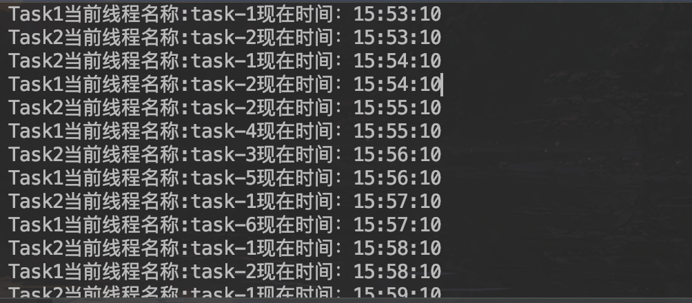

## springboot中配置定时任务(Cron表达式)线程池方式

[项目地址](https://github.com/heng1234/springboot2.x/tree/master/boot_task):https://github.com/heng1234/springboot2.x/tree/master/boot_task

##### Quartz Cron表达式:https://blog.csdn.net/qq_39313596/article/details/90438580

Quartz Cron表达式在线生成地址:http://cron.qqe2.com/


开始使用:

首先在启动类加上@EnableScheduling开启定时任务

```java
import org.springframework.boot.SpringApplication;
import org.springframework.boot.autoconfigure.SpringBootApplication;
import org.springframework.scheduling.annotation.EnableScheduling;

//开启定时任务
@EnableScheduling
@SpringBootApplication
public class BootTaskApplication {

    public static void main(String[] args) {
        SpringApplication.run(BootTaskApplication.class, args);
    }

}
```


接着配置线程池

```java
import org.springframework.context.annotation.Bean;
import org.springframework.context.annotation.Configuration;
import org.springframework.scheduling.annotation.SchedulingConfigurer;
import org.springframework.scheduling.concurrent.ThreadPoolTaskScheduler;
import org.springframework.scheduling.config.ScheduledTaskRegistrar;

/**
 *  spring boot 多线程并发定时任务
 *  所有的任务都在同一个线程池但不同线程中完成
 * @author : kaifa
 * create at:  2019-11-08  15:24
 * @description: 定时任务线程池
 */
@Configuration
public class SchedulingConfig implements SchedulingConfigurer {
    @Override
    public void configureTasks(ScheduledTaskRegistrar taskRegistrar) {
        taskRegistrar.setScheduler(taskScheduler());
    }


    /**
     * 定时任务使用的线程池
     * 使用@Bean注解，在不配置destroyMethod时，其默认值为：
     *
     * String destroyMethod() default AbstractBeanDefinition.INFER_METHOD;
     *
     *
     * public static final String INFER_METHOD = "(inferred)";
     * 也就是在不配置destroyMethod时，spring会使用推断的销毁方法，这种推断的方法要求满足：
     *
     * 1. public的
     * 2. 无参数
     * 3. 方法名为close或shutdown
     *
     * 如果当一个bean正好有上面的方法，那么就会在销毁时调用。比如redis.clients.jedis.BinaryJedis 及子类就满足要求，
     * 有一个shutdown方法。但是他的shutdown方法是向redis-server发送shutdown命令，并不是销毁连接。
     * 因此在这个Bean销毁时，其实是不希望调用该shutdown方法的。
     * 如果想防止调用推断的销毁方法，需要给destroyMethod赋值为""：
     *
     * @Bean(destroyMethod = "")
     *该方法会检查销毁的方法（requiresDestruction里），并且注册DisposableBeanAdapter，DisposableBeanAdapter会最终调用bean的destroyMethod。
     *
     *
     * protected void registerDisposableBeanIfNecessary(String beanName, Object bean, RootBeanDefinition mbd) {
     *         AccessControlContext acc = (System.getSecurityManager() != null ? getAccessControlContext() : null);
     *         if (!mbd.isPrototype() && requiresDestruction(bean, mbd)) {
     *             if (mbd.isSingleton()) {
     *                 // Register a DisposableBean implementation that performs all destruction
     *                 // work for the given bean: DestructionAwareBeanPostProcessors,
     *                 // DisposableBean interface, custom destroy method.
     *                 registerDisposableBean(beanName,
     *                         new DisposableBeanAdapter(bean, beanName, mbd, getBeanPostProcessors(), acc));
     *             }
     *             else {
     *                 // A bean with a custom scope...
     *                 Scope scope = this.scopes.get(mbd.getScope());
     *                 if (scope == null) {
     *                     throw new IllegalStateException("No Scope registered for scope name '" + mbd.getScope() + "'");
     *                 }
     *                 scope.registerDestructionCallback(beanName,
     *                         new DisposableBeanAdapter(bean, beanName, mbd, getBeanPostProcessors(), acc));
     *             }
     *         }
     *     }
     * @return
     */
    @Bean(destroyMethod = "shutdown", name = "taskScheduler")
    public ThreadPoolTaskScheduler taskScheduler(){
        ThreadPoolTaskScheduler scheduler = new ThreadPoolTaskScheduler();
        scheduler.setPoolSize(10);//线程数量
        scheduler.setThreadNamePrefix("task-");//线程名前缀
        scheduler.setAwaitTerminationSeconds(600);//waitForTasksToCompleteOnShutdown的等待的时长，默认值为0，即不等待。
        scheduler.setWaitForTasksToCompleteOnShutdown(true);//是否等待所有线程执行完毕才关闭线程池，默认值为false。
        return scheduler;
    }


}
```

使用定时任务:

```java
import org.springframework.scheduling.annotation.Scheduled;
import org.springframework.stereotype.Component;

import java.text.SimpleDateFormat;
import java.util.Date;

/**
 * @author : kaifa
 * create at:  2019-11-08  14:26
 * @description: 定时任务
 */

@Component
public class TaskTest {
    // 定义每过10秒执行任务
   // @Scheduled(fixedRate = 10000)
    @Scheduled(cron = "10 * * * * ?")
    public void Task1() {
        SimpleDateFormat dateFormat = new SimpleDateFormat("HH:mm:ss");
        System.out.println("Task1当前线程名称:"+Thread.currentThread().getName()+"现在时间：" + dateFormat.format(new Date()));
    }

    // 定义每过10秒执行任务
    @Scheduled(cron = "10 * * * * ?")
    public void Task2() {
        SimpleDateFormat dateFormat = new SimpleDateFormat("HH:mm:ss");
        System.out.println("Task2当前线程名称:"+Thread.currentThread().getName() +"现在时间："+ dateFormat.format(new Date()));
    }


}
```

运行项目控制台打印:

