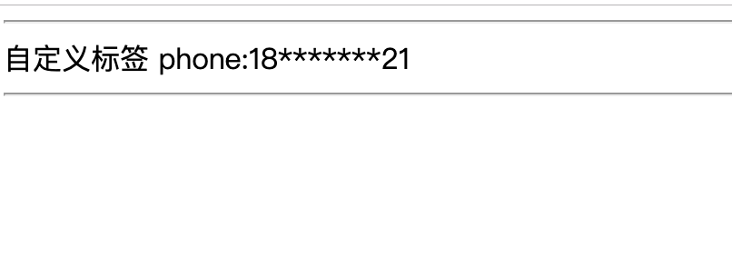

# SpringBoot整合Thymeleaf——自定义标签

**[项目地址](https://github.com/heng1234/springboot2.x/tree/master/boot_thymeleaf): https://github.com/heng1234/springboot2.x/tree/master/boot_thymeleaf**

基于上一章节**[springBoot整合Thymeleaf](./tf.md)**

thymeleaf 丰富的扩展性为我们实现自定义的标签实现了可能。这里以创建数据脱敏标签这个需求为例，讲解下如何实现自定义的dialect。

需求描述：
controller的model中我们有客户的手机号信息："phone": "11111111111"。
按照默认的写法，要在页面中展示手机号，HTML模板为：

```html
<span th:text="${phone}"></span>
```

如果不使用自定义dialect，这里会将完整的手机号展示出来：

```html
<span>11111111111</span>
```

接下来我们打算打造一个自定义方言：

```html
<span hlvy:text="${phone}"></span>
```

实现如下的效果：

```html
<span>11*******11</span>
```

除了首位2个字符全部替换为星号是自定义dialect的默认行为。除此之外，我们还可以使用正则表达式来定义替换规则。比如，除了前两个字符，其余的全替换为星号：

```html
<p hlvy:text="${phone}" hlvy:pattern="^.{2}(.*)$"></p>
```

# 实现自定义标签处理器

对于Thymeleaf方言，自定义标签的处理逻辑是在标签处理器定义的。
自定义标签处理器需要实现`AbstractAttributeTagProcessor` 接口，标签的处理逻辑在`doProcess` 方法中编写。

数据脱敏标签的处理器代码如下所示：

ThSysTagProcessor

```java
import org.thymeleaf.IEngineConfiguration;
import org.thymeleaf.context.ITemplateContext;
import org.thymeleaf.engine.AttributeName;
import org.thymeleaf.model.IAttribute;
import org.thymeleaf.model.IProcessableElementTag;
import org.thymeleaf.processor.element.AbstractAttributeTagProcessor;
import org.thymeleaf.processor.element.IElementTagStructureHandler;
import org.thymeleaf.standard.expression.IStandardExpression;
import org.thymeleaf.standard.expression.IStandardExpressionParser;
import org.thymeleaf.standard.expression.StandardExpressions;
import org.thymeleaf.templatemode.TemplateMode;

import java.util.regex.Matcher;
import java.util.regex.Pattern;

/**
 * @author : kaifa
 * create at:  2019-10-24  15:53
 * @description: 自定义tf标签配置类
 */
public class ThSysTagProcessor  extends AbstractAttributeTagProcessor {
    private static final String TEXT_ATTRIBUTE  = "text";
    private static final int PRECEDENCE = 10000;
    private static final String PATTERN_ATTRIBUTE = "pattern";

    private static final String DEFAULT_PATTERN = "^.{2}(.*).{2}$";
    /**
        templateMode: 模板模式，这里使用HTML模板。
         dialectPrefix: 标签前缀。即xxx:text中的xxx。在此例子中prefix为thSys。
         elementName：匹配标签元素名。举例来说如果是div，则我们的自定义标签只能用在div标签中。为null能够匹配所有的标签。
         prefixElementName: 标签名是否要求前缀。
         attributeName: 自定义标签属性名。这里为text。
         prefixAttributeName：属性名是否要求前缀，如果为true，Thymeeleaf会要求使用text属性时必须加上前缀，即thSys:text。
         precedence：标签处理的优先级，此处使用和Thymeleaf标准方言相同的优先级。
         removeAttribute：标签处理后是否移除自定义属性。*/
    public ThSysTagProcessor( String dialectPrefix) {
        // 方言名称，前缀，处理优先级
        super(TemplateMode.HTML, dialectPrefix, null, false, TEXT_ATTRIBUTE, true, PRECEDENCE, true);
    }

    @Override
    protected void doProcess(ITemplateContext iTemplateContext, IProcessableElementTag iProcessableElementTag, AttributeName attributeName, String s, IElementTagStructureHandler iElementTagStructureHandler) {
        //s为自定义属性text的内容，如果s为表达式，该函数可以获取表达式的值
        final Object value = getExpressionValue(iTemplateContext, s);

        IAttribute patternAttribute = iProcessableElementTag.getAttribute(PATTERN_ATTRIBUTE);
        if (null == patternAttribute) {
            // 设置标签的内容
            iElementTagStructureHandler.setBody(doMasking(value.toString(), DEFAULT_PATTERN), false);
        } else {
            String patternValue = iProcessableElementTag.getAttribute(PATTERN_ATTRIBUTE).getValue();
            iElementTagStructureHandler.setBody(doMasking(value.toString(), patternValue), false);
        }
    }

    private static String doMasking(String target, String patternString) {
        Pattern pattern = Pattern.compile(patternString);
        Matcher matcher = pattern.matcher(target);
        if (matcher.matches()) {
            if (matcher.groupCount() < 1) {
                return target;
            }
            String group = matcher.group(1);
            StringBuilder stringBuilder = new StringBuilder();
            for (int i = 0; i < group.length(); i++) {
                stringBuilder.append("*");
            }
            return target.replace(group, stringBuilder.toString());
        }
        return target;
    }

    private Object getExpressionValue(ITemplateContext iTemplateContext, String expressionString) {
        final IEngineConfiguration configuration = iTemplateContext.getConfiguration();
        final IStandardExpressionParser parser = StandardExpressions.getExpressionParser(configuration);
        // 解析expression
        final IStandardExpression expression = parser.parseExpression(iTemplateContext, expressionString);
        // 获取expression的执行结果
        return expression.execute(iTemplateContext);
    }
}
```

# 定义方言类

编写好之定义标签的处理器之后，别忘了定义一个方言类。在方言类中，我们需要给出方言的名称，前缀，处理优先级和涉及到的一系列自定义标签处理器。代码如下所示：

ThSysTagProcessor

```java
import org.thymeleaf.dialect.AbstractProcessorDialect;
import org.thymeleaf.processor.IProcessor;
import org.thymeleaf.standard.StandardDialect;

import java.util.HashSet;
import java.util.Set;

/**
 * @author : kaifa
 * create at:  2019-10-24  16:07
 * @description: 定义方言类
 */
public class ThSysDialect extends AbstractProcessorDialect {
    private static final String PREFIX = "hlvy";
    public ThSysDialect() {
        // 方言名称，前缀，处理优先级
        super("Tf Hlvy", "hlvy", StandardDialect.PROCESSOR_PRECEDENCE);
    }
    @Override
    public Set<IProcessor> getProcessors(String s) {
        // 把所有的自定义tag处理器加入处理器集，这个例子中我们只有这一个自定义处理器
        final Set<IProcessor> processorSet = new HashSet<>();
        ThSysTagProcessor thSysTagProcessor = new ThSysTagProcessor(PREFIX);
        processorSet.add(thSysTagProcessor);
        return processorSet;
    }
}
```

注册bean

TfConfig

```java
/**
 * @author : kaifa
 * create at:  2019-10-24  16:11
 * @description: tf bean
 */
@Configuration
public class TfConfig {
    @Bean
    public ThSysDialect thSysDialect() {
        return new ThSysDialect();
    }
}
```

Controller

```java
@RequestMapping("phone.do")
public String toPhone(HttpServletRequest request, String phone, Model model){
    model.addAttribute("phone",phone);
    return "phone";
}
```

Phone.html

```html
<!DOCTYPE html>
<html lang="en">
<!--<html xmlns:th="http://www.thymeleaf.org"> 这可以省略-->
<head>
    <meta charset="UTF-8">
    <title>Title</title>
</head>
<body>

  <div>
      <hr/>
      自定义标签    phone:<span hlvy:text="${phone}"></span>
      <hr/>
  </div>
</body>
</html>
```

测试

http://localhost:7004/tf/phone.do?phone=18616283921

