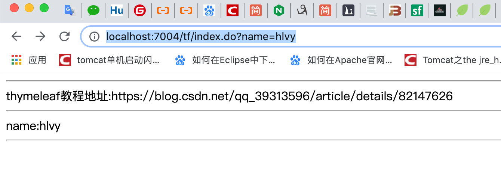

# SpringBoot整合Thymeleaf

[项目地址](https://github.com/heng1234/springboot2.x/commit/25bbc2433c6f5953575d22d3179383bf7273d82d)：https://github.com/heng1234/springboot2.x/commit/25bbc2433c6f5953575d22d3179383bf7273d82d

语法参考:[springboot整合thymeleaf及常用标签的使用方法](https://blog.csdn.net/qq_39313596/article/details/82147626)

### 常用模板引擎对比

|  模板引擎  |                             优点                             |                             缺点                             |
| :--------: | :----------------------------------------------------------: | :----------------------------------------------------------: |
|    jsp     | 1、功能强大，可以写java代码 2、支持jsp标签（jsp tag） 3、支持表达式语言（el） 4、官方标准，用户群广，丰富的第三方jsp标签库 5、性能良好。jsp编译成class文件执行，有很好的性能表现 | 动态资源和静态资源全部耦合在一起，必须要在支持java的web服务器里运行（例如tomcat，jetty，resin等）服务器压力大 |
| FreeMarker | 1、不能编写java代码，可以实现严格的mvc分离 2、性能非常不错 3、对jsp标签支持良好 4、内置大量常用功能，使用非常方便 5、宏定义（类似jsp标签）非常方便 6、使用表达式语言 |      1、不是官方标准 2、用户群体和第三方标签库没有jsp多      |
| Thymeleaf  | 静态html嵌入标签属性，浏览器可以直接打开模板文件，便于前后端联调。springboot官方推荐方案。 |                     模板必须符合xml规范                      |

### SpringBoot整合Themeleaf

###### pom

```xml
<!--thymeleaf-->
<dependency>
   <groupId>org.springframework.boot</groupId>
   <artifactId>spring-boot-starter-thymeleaf</artifactId>
</dependency>
<!--web-->
<dependency>
   <groupId>org.springframework.boot</groupId>
   <artifactId>spring-boot-starter-web</artifactId>
</dependency>
   <!--lombok-->
<dependency>
   <groupId>org.projectlombok</groupId>
   <artifactId>lombok</artifactId>
   <optional>true</optional>
</dependency>

<!-- 允许使用非严格的 HTML 语法 -->
<dependency>
   <groupId>net.sourceforge.nekohtml</groupId>
   <artifactId>nekohtml</artifactId>
   <version>1.9.22</version>
</dependency>
```

###### application.properties

```properties
server.port=7004
#开启模板缓存（默认值：true）
#开发时关闭缓存,不然没法看到实时页面
spring.thymeleaf.cache=false 
#Check that the template exists before rendering it.
spring.thymeleaf.check-template=true 
#检查模板位置是否正确（默认值:true）
spring.thymeleaf.check-template-location=true
#Content-Type的值（默认值：text/html）
spring.thymeleaf.servlet.content-type=text/html
#开启MVC Thymeleaf视图解析（默认值：true）
spring.thymeleaf.enabled=true
#模板编码
spring.thymeleaf.encoding=UTF-8
#要被排除在解析之外的视图名称列表，用逗号分隔
spring.thymeleaf.excluded-view-names=
#要运用于模板之上的模板模式。另见StandardTemplate-ModeHandlers(默认值：HTML5)
# 用非严格的 HTML
spring.thymeleaf.mode=HTML5
#在构建URL时添加到视图名称前的前缀（默认值：classpath:/templates/）
spring.thymeleaf.prefix=classpath:/templates/
#在构建URL时添加到视图名称后的后缀（默认值：.html）
spring.thymeleaf.suffix=.html
#Thymeleaf模板解析器在解析器链中的顺序。默认情况下，它排第一位。顺序从1开始，只有在定义了额外的TemplateResolver Bean时才需要设置这个属性。
#spring.thymeleaf.template-resolver-order=
#可解析的视图名称列表，用逗号分隔
#spring.thymeleaf.view-names=
#spring.mvc.view.prefix=/
#spring.mvc.view.suffix=.html
```

###### Controller

```java
import org.springframework.stereotype.Controller;
import org.springframework.ui.Model;
import org.springframework.web.bind.annotation.RequestMapping;

import javax.servlet.http.HttpServletRequest;

/**
 * @author : kaifa
 * create at:  2019-10-23  13:55
 * @description: thymeleaf 控制层
 */
@Controller
@RequestMapping("tf")
public class ThyeleafController {


    @RequestMapping("index.do")
    public String toIndex(HttpServletRequest request, String name, Model model){
        model.addAttribute("name",name);
        model.addAttribute("href","https://blog.csdn.net/qq_39313596/article/details/82147626");
        return "index";
    }
}
```

###### templates新建index.html

```html
<!DOCTYPE html>
<html lang="en">
<!--<html xmlns:th="http://www.thymeleaf.org"> 这可以省略-->
<head>
    <meta charset="UTF-8">
    <title>Title</title>
</head>
<body>

  <div>
      <hr/>
      thymeleaf教程地址:<span th:text="${href}"></span>
      <hr/>
      name:<span th:text="${name}"></span>
      <hr/>
  </div>
</body>
</html>
```

###### 访问http://localhost:7004/tf/index.do?name=hlvy



下一章: [SpringBoot整合Thymeleaf——自定义标签](./customizetf.md)